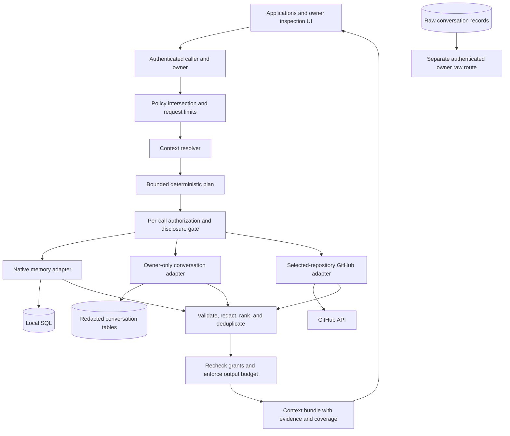
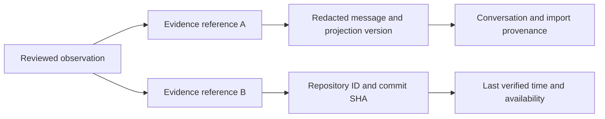

# OpenMemory federated context architecture report

This proposal was prepared on 2026-09-22 against the existing repository. Its status is proposed, and it does not authorize changes to the privacy boundaries in AGENTS.md. Provider findings describe the documentation available on that date, not guarantees of access for every account or deployment.

## 1. Executive summary

The recommendation is MODIFY. Build a user-controlled retrieval and disclosure service that combines local records with selected remote sources. Federation should be one retrieval strategy, not a requirement that prevents users from preserving their history. The useful output is bounded evidence with permissions, provenance, freshness, and coverage information.

Keep Laravel, SQL, the conversation importers, deterministic redaction, lexical retrieval, and the inspection UI. Introduce a resolver above those components instead of converting every artifact into a memory or replacing the application. Keep ICP available as an optional integration with its existing signing guarantees, rather than requiring it for ownership, identity, or durable local storage.

The immediate prerequisite is authenticated ownership. The current history controller selects an owner but does not authenticate that person. The proposed resolver would otherwise amplify an existing trust gap across more sources. A second prerequisite is separating retrieved content from trusted model instructions. The current history Ask implementation contradicts its own documented separation.

The smallest credible product experiment combines explicitly saved native memory, existing imported history, and live GitHub commit metadata for selected repositories. The three-source experiment runs through the authenticated owner's history review surface. Third-party API and MCP consumers do not receive imported history under the current repository rules. The experiment needs neither an LLM planner nor persistent inferred observations.

This report contains proposed architecture and implementation steps. No application code, schema, provider connections, or deployment configuration was changed for this audit. The accompanying [ADR index](../adr/README.md) records decisions that remain proposed.

## 2. Existing repository architecture

### Application and deployment

The reference application is Laravel 12 with PHP 8.2 or later declared in Composer. Docker uses PHP 8.3. Vue 3, Inertia, Vite, and Tailwind provide the browser interface; D3 and Three.js render graph experiments. SQLite is the local database default, while Docker Compose runs PostgreSQL 16. Eloquent models and concrete services implement most domain behavior.

The repository has four execution surfaces. The Laravel application handles imports, retrieval, chat, and graph operations. The Node CLI wraps setup and archive import and also creates candidate manifests from explicit local text sources. A Node MCP server bridges external applications to Laravel and ICP. The separate `agent/` directory implements an autonomous agent and Discord connector. The agent is a consumer prototype, not a required component of a context server.

Docker Compose includes PHP-FPM, nginx, PostgreSQL, a queue worker, and a Node ICP adapter. The deployment is development-oriented: source directories are bind-mounted, ports are published without loopback restrictions, the database has a fallback password, and the adapter installs packages at startup. The Dockerfile installs command-line ZIP utilities but does not explicitly install PHP's ZIP extension, which `ZipArchiveSource` requires. A queue worker does not run the Laravel scheduler; the Compose file does not supply a scheduler service. These are deployment readiness gaps, not reasons to replace the stack. See [Compose](../../docker-compose.yml), [Dockerfile](../../docker/php/Dockerfile), and [scheduled commands](../../app/routes/console.php).

### Existing data model

| Model family | Current responsibility and relationship |
|---|---|
| Users and sessions | Laravel has conventional user records, but domain services generally use free-form string identities instead of authenticated user relationships. |
| Messages | Live chat transcripts belong to session IDs and are separate from imported conversation messages. |
| MemoryNode and MemoryEdge | UUID nodes contain content, type, sensitivity, labels, tags, confidence, source strings, metadata, and access counters. Directed edges describe relationships and mutable retrieval weights. |
| EvidenceFact | Document claims reference source nodes and optional document anchors, with quote spans, observation times, confidence, and metadata. |
| ConversationImport | Each import records owner, provider, parser version, source path and hash, status, counters, and warnings. |
| Conversation and ConversationMessage | Provider identifiers, message roles, branch information, timestamps, normalized text, hashes, and provider metadata preserve imported structure. |
| ConversationRawRecord | Unredacted source payloads are stored separately from normalized retrieval text. Multiple source versions can exist for one conversation. |
| RedactionPolicy | Owner-specific configuration supplements mandatory redaction categories. |
| Agents, shared edges, and snapshots | These support collective-memory and graph experiments rather than application authorization. |

Conversation identity is currently unique by owner, provider, and provider conversation ID. External account identity is not part of that key. Multiple accounts at one provider therefore need deliberate identity partitioning before connector expansion. Raw rows use a nullable conversation foreign key with `nullOnDelete`; the history deletion controller explicitly removes raw rows before deleting the conversation. That behavior is not a database cascade and is not transactional in the controller. See the [migrations](../../app/database/migrations) and [history controller](../../app/app/Http/Controllers/ConversationHistoryController.php).

### Ingestion and retrieval

Archive ingestion is a strong independent subsystem. ChatGPT, Claude, and Gemini adapters implement `ConversationArchiveAdapter`, detect supported formats, stream normalized conversations, and report unsupported input. The archive layer checks ZIP paths and sizes and bounds JSON elements. Importing is local, uses per-conversation transactions, preserves branches, redacts message bodies, and merges repeated exports. Previously imported messages missing from a later export are deliberately retained. Attachment metadata is retained, but attachment bytes are not imported. See [ConversationImportService](../../app/app/Services/Conversations/ConversationImportService.php) and [adapter contract](../../app/app/Services/Conversations/Adapters/ConversationArchiveAdapter.php).

History search performs SQL substring filtering and deterministic PHP scoring. Its candidate pool contains at most 2,000 matching messages ordered newest first. Ask selects excerpts, optionally calls the configured model, and checks whether citation labels resolve. The citation check does not establish whether the cited text supports a claim. The current temporal surface groups term matches by month; it is not a temporal reasoning engine. See [conversation retrieval](../../app/app/Services/Conversations/ConversationEvidenceRetrievalService.php).

Live chat follows redaction, graph retrieval, model generation, memorability scoring, summarization, and storage. Graph retrieval implements six strategies; configuration defaults to lexical query relevance. There is no embedding store or vector search implementation. Graph traversal, reinforcement, consolidation, and pruning operate on SQL nodes. Document ingestion creates an anchor, chunks, extracted graph metadata, and evidence facts. GitHub ingestion fetches commits and distills them into stored memories through a model. It is not live federated search.

Memory records also exist in the ICP canister or, in mock mode, a cache with two-hour expiry. SQL graph records have different identifiers and persistence. Browser writes are signed directly to the canister; graph synchronization follows separately. MCP uses a file identity for signed ICP writes and a shared API key for Laravel requests. The LLM interface is replaceable, but the registered implementation uses OpenRouter. See [MemoryGraphService](../../app/app/Services/MemoryGraphService.php), [IcpMemoryService](../../app/app/Services/IcpMemoryService.php), and [service bindings](../../app/app/Providers/AppServiceProvider.php).

### API, frontend, documentation, and tests

The HTTP surface mixes browser routes, history APIs, graph controls, document ingestion, and MCP endpoints in `routes/web.php`. There is no versioned general memory API or portable export/import format. The Vue UI exposes Chat, History, Memory, Graph, and experimental agent views. History already provides inspectable evidence; Memory primarily presents canister or mock records rather than a canonical local store.

README, ROADMAP, VISION, RESEARCH, SCIENCE, SECURITY, and DEVLOG document successive research directions. The 2026-09-10 roadmap already identifies derivation, stronger retrieval, per-client permissions, and portability as missing. Its recommendation to prioritize derivation should be reconsidered after the ownership and disclosure findings below. Historical research results remain dated evidence, including the reported failure of graph expansion to improve the measured lexical baseline.

During the preceding audit in this session, `php artisan test` passed 412 tests with 2,060 assertions. Frontend checks were attempted but did not complete through the execution environment; the approval request was interrupted. No frontend or build success is claimed. CI specifies backend tests, frontend tests and build, and agent syntax checks. It does not provide a PostgreSQL test matrix or a live ICP integration test, and the root CLI suite is not wired into that workflow. Tests use fabricated fixtures; no personal archive or database was inspected. See [CI](../../.github/workflows/ci.yml) and [fixtures](../../app/tests/Support/ConversationFixtures.php).

## 3. What the existing project gets right

Preserve the separation between original imported evidence and redacted projections. Preserve stable provider IDs, parser versions, branching, unknown timestamps, warnings, and idempotent imports. These decisions are directly useful when sources disagree or parsers improve.

Preserve evidence-first retrieval that works without a model key, public-only filtering on legacy external recall, and the rule that archive parsing acquires no network dependency. Keep deterministic lexical retrieval as the measurable baseline. Extend synthetic fixtures to exercise source failures, malicious text, and temporal ambiguity rather than testing against personal exports.

Preserve the replaceable LLM contract and provider archive contract without merging them. A parser, a remote retrieval connector, and a model are different trust boundaries. Preserve the canister's caller-verified ownership for its own records while recognizing that it does not authenticate Laravel requests.

The conventional application stack is an advantage. Existing SQL, HTTP clients, migrations, services, and testing tools can support the proposed resolver without a new language, graph database, or distributed control plane.

## 4. Where it conflicts with the new vision

The following are code findings, not claims that a deployed instance was exploited.

| Finding | Evidence and architectural consequence |
|---|---|
| Owner selection is mistaken for authentication. | `ConversationHistoryController::ownerId()` returns a configured identity for any request; otherwise it trusts a session value. History routes lack authentication middleware. A configured corpus is accessible to whoever can reach those routes. |
| A browser-supplied principal becomes a Laravel identity. | `ChatController::send()` accepts the first principal string without verifying a signed assertion. The canister authenticates its own calls, but that guarantee does not extend to SQL graph access or history sessions. |
| MCP has deployment-wide authority. | `McpController` checks one shared key and accepts `user_id` from the body. That is not a per-application, per-owner grant. Only `/mcp/store` is CSRF-exempt, despite other server-to-server POST routes. Tests do not establish production transport behavior. |
| Mock inspection differs from live access control. | `MemoryController` reads recent records across users; `IcpMemoryService::mockListRecent()` does not exclude private or sensitive records. The live canister's global listing does filter them. Mock mode must not be treated as a secure private store. |
| Untrusted excerpts enter trusted instructions. | `ConversationAskService::systemPrompt()` appends excerpts to the system prompt. Its tests assert that placement, while SECURITY.md says imported text must never enter a system instruction. Delimiters do not repair the structural mismatch. |
| Redaction is incomplete across metadata. | Import redacts message text but assigns the conversation title directly. Ask includes that title in its model prompt. Titles, labels, URLs, and provider error bodies require the same disclosure analysis as message bodies. |
| Private storage is not a model-processing policy. | `DocumentIngestionService` invokes graph and fact extraction for all sensitivities. Private documents can therefore cross a model boundary during ingestion despite being excluded from later chat recall. |
| Logging can retain sensitive material. | Graph and fact extraction log response prefixes; document ingestion logs chunk previews; GitHub ingest logs response bodies. Future connectors must not inherit those patterns. |
| Memory has conflicting authorities and lifecycles. | Canister/cache and SQL writes are separate. Scheduled graph pruning hard-deletes dormant nodes, while consolidation uses `supersedes` for summarization rather than factual replacement. These operations cannot govern user-saved canonical memories. |
| Source and provenance are inconsistent. | Imported conversations have rich lineage; chat memories have source strings; documents use anchor nodes and metadata; GitHub uses ad hoc metadata. There is no uniform evidence envelope or persisted dependency policy. |

The relevant implementations are [ChatController](../../app/app/Http/Controllers/ChatController.php), [McpController](../../app/app/Http/Controllers/McpController.php), [bootstrap middleware](../../app/bootstrap/app.php), [ConversationAskService](../../app/app/Services/Conversations/ConversationAskService.php), [DocumentIngestionService](../../app/app/Services/DocumentIngestionService.php), and [PruneMemoryNodes](../../app/app/Console/Commands/PruneMemoryNodes.php).

The existing private-history containment is intentional, not technical debt to remove. A generic resolver must not become a new route around the prohibition on imported history in MCP, chat recall, or the public graph. Broad external sharing requires a separate owner decision and amended policies before implementation.

## 5. Assessment of the federated context thesis

Federation reduces unnecessary replication and can preserve current provider permissions. It also leaves availability, historical completeness, and access under provider control. A deleted message, closed account, changed API, or revoked organizational entitlement can make a reference unusable. User ownership therefore requires both selective live access and the ability to keep deliberate local copies.

Replace the proposed governing principle with: execute retrieval in an authorized location, disclose the minimum necessary information, and retain copies only under an explicit retention choice. Most provider APIs do not execute arbitrary user computation. They run provider-defined searches, return data over a network, and may observe or retain the query. The resolver must treat queries themselves as disclosures.

An authoritative source is authoritative about its own record, not necessarily about reality. A calendar event proves scheduling, not attendance. A commit timestamp is not proof of work performed at that instant. An assistant message is not proof that the user holds the stated preference. Keep these distinctions in fragment types and attribution.

Federation is appropriate for occasional, narrow, current retrieval. Local indexes become appropriate for repeated semantic queries, unsupported server search, predictable latency, or offline requirements. Explicit mirrors are appropriate for preservation and historical reproducibility. The system must report which guarantee it is providing.

## 6. Major assumptions that are wrong or risky

| Assumption under challenge | Proposed answer |
|---|---|
| Context should be the root persisted entity. | Context should describe a request and its selected evidence. Keep source artifacts and native memories in their existing or purpose-specific stores. |
| Most external data should always remain remote. | Choose retention per source and user intent; references alone cannot provide durable ownership. |
| Natural language is a sufficient primary interface. | Accept a query alongside typed filters, source constraints, an optional temporal operator, and explicit budgets. Prose cannot define authorization. |
| A query planner requires an agent. | A two-stage deterministic recipe handles the first temporal use case. General autonomous planning has no demonstrated need. |
| A provider score means the same thing everywhere. | Preserve score semantics and rerank permitted excerpts locally; never compare unrelated numeric scores as probabilities. |
| A label such as work establishes permission. | Labels are routing hints backed by explicit grant selectors, not classifier-generated access rights. |
| Revocation can retract previously returned context. | Stop future access and purge governed copies. A recipient can retain data already disclosed, which OpenMemory cannot reliably recall. |
| A derived statement can outlive all evidence safely. | Persist only reviewed observations with dependency tracking; unavailable evidence changes their usability. |
| Newer evidence automatically disproves older evidence. | Represent corrections and conflicting claims explicitly; changes over time are not always contradictions. |
| Redaction prevents prompt injection or guarantees privacy. | Redaction removes selected patterns. Untrusted-data handling, authorization, output limits, and consumer tool controls remain necessary. |
| A connector interface isolates connector code. | In-process code shares application privilege. Only trusted bundled connectors qualify initially. |
| A personal graph requires merging people across providers. | Keep owner identity, external account identity, and mentioned people separate. Cross-source person linking requires explicit evidence or user confirmation. |
| Every resolution should save useful conclusions. | Resolution is read-only with transient results. Saving a memory or observation is a separate operation. |
| Cloud is required for cross-application identity. | One self-hosted authority can issue application credentials and own its namespace. Federation between identity authorities can wait. |

Offline resolution serves native records and deliberately retained local sources. Remote-only sources return an unavailable status. Rate limits and outages produce partial bundles, not broader searches or silent historical claims. Stale caches never override local revocation.

## 7. Relevant existing standards and projects

### Standards and reusable techniques

| Standard or technique | Fit, complexity, and simpler choice |
|---|---|
| OAuth and PKCE | Use delegated provider access with authorization-code flows, PKCE S256 where supported, exact redirect validation, and session-bound state. OAuth adds token lifecycle and consent complexity; a selected-repository fine-grained token is sufficient for the first local GitHub experiment. [RFC 9700](https://www.rfc-editor.org/info/rfc9700/) supplies the security baseline. |
| OpenID Connect | OIDC authenticates an account; it does not grant access to its mail or files. Keep issuer and subject distinct from email addresses. Local Laravel authentication is simpler initially. See [OIDC Core](https://openid.net/specs/openid-connect-core-1_0.html). |
| MCP | Reuse MCP as an application transport and possible connector transport. It does not define personal-data semantics or resource-level policy. Pin an implemented revision and test clients rather than claim generic compliance. HTTP authorization needs audience validation and separate upstream credentials; token passthrough is prohibited. See [authorization](https://modelcontextprotocol.io/specification/2025-11-25/basic/authorization) and [security guidance](https://modelcontextprotocol.io/docs/2025-11-25/tutorials/security/security_best_practices). |
| Solid and personal data pods | Solid directly overlaps with user-controlled storage and application access. A pod could become a storage connector. Making it the Core persistence model adds linked-data and protocol obligations without solving closed-provider access. SQL and portable JSON remain simpler today. See [Solid Protocol](https://solidproject.org/TR/protocol). |
| ActivityPub | ActivityPub fits federated social activity delivery, not arbitrary private mailbox or personal-context search. Consider it only for a future social source connector. REST retrieval is sufficient for the MVP. See [ActivityPub](https://www.w3.org/TR/activitypub/). |
| W3C PROV | Reuse the distinction between entities, activities, agents, attribution, and derivation. A small JSON provenance envelope can map to PROV without introducing RDF storage or a complete ontology. See [PROV Overview](https://www.w3.org/TR/prov-overview/). |
| Data Transfer Project | DTP overlaps with user-authorized service-to-service portability and adapter design. It moves data rather than resolving minimal context. Reuse formats and adapters where compatible; an owner export remains simpler than adopting its transfer framework. See [DTP](https://github.com/dtinit/data-transfer-project). |
| Capability authorization | Attenuated authority is useful for a future distributed runtime. Biscuit adds distributed verification and a policy language, but revocation still needs state. Database-backed grants are simpler for one server. See [Biscuit goals and limits](https://www.biscuitsec.org/docs/why-biscuit/). |
| Local-first patterns | Apply local operation, durable files, and export before synchronization. CRDTs become useful only when concurrent edits exist; they do not resolve factual contradictions. See [Ink & Switch](https://www.inkandswitch.com/essay/local-first/). |
| Zero-trust principles | Authenticate each caller and authorize each operation rather than trusting loopback, network location, or a provider connection. No separate zero-trust platform is required. See [NIST SP 800-207](https://csrc.nist.gov/pubs/sp/800/207/final). |
| Vector and hybrid retrieval | Add embeddings only after a measured lexical gap. PostgreSQL with pgvector is an available later implementation, not a new required service. Approximate search with filters needs recall testing. See [pgvector](https://github.com/pgvector/pgvector). |
| Federated ranking | Rank fusion can combine ranked lists without pretending raw scores are comparable. Start with bounded local lexical ranking and source diversity; test fusion later. See the [reciprocal rank fusion paper](https://research.google/pubs/reciprocal-rank-fusion-outperforms-condorcet-and-individual-rank-learning-methods/). |

Embeddings belong to the sensitive-data threat model. Published experiments reconstruct text from embeddings under studied conditions, so an index cannot be described as anonymous merely because original text is omitted. Private information retrieval and encrypted computation do not make arbitrary SaaS APIs privately searchable; the MVP uses local processing and query minimization instead. See [Text Embeddings Reveal Almost As Much As Text](https://arxiv.org/abs/2310.06816).

### Current provider capabilities

| Provider surface | Verified capability and architectural limit |
|---|---|
| Gmail | The list API accepts Gmail-style queries and returns message IDs; retrieving content needs subsequent calls. The `gmail.metadata` scope cannot use `q`, while `gmail.readonly` is restricted. Google documents verification and assessment requirements for restricted data stored or transmitted through servers. Gmail is feasible, but not the cheapest first connector. See [message listing](https://developers.google.com/workspace/gmail/api/reference/rest/v1/users.messages/list) and [scopes](https://developers.google.com/workspace/gmail/api/auth/scopes). |
| Google Drive and Calendar | Drive offers file filtering and content retrieval; Calendar offers event queries and time bounds. Their query semantics differ and require separate capability declarations. See [Drive search](https://developers.google.com/workspace/drive/api/guides/search-files) and [Calendar events](https://developers.google.com/workspace/calendar/api/v3/reference/events/list). |
| Google Photos | The Library API is limited to app-created content after the documented 2025 change. The Picker API lets users select existing photos. An unattended whole-library `photos.search` capability cannot be assumed. See [Google's API update](https://developers.googleblog.com/google-photos-picker-api-launch-and-library-api-updates/). |
| Google intelligence | Gemini's consumer Personal Intelligence is a product capability, not proof of a general third-party account-query API. Gemini Enterprise documents provider connectors and federation, which depend on an enterprise deployment. Neither makes a Gemini model API key a Gmail authorization grant. See [consumer announcement](https://blog.google/innovation-and-ai/products/gemini-app/personal-intelligence/) and [enterprise connector documentation](https://docs.cloud.google.com/gemini/enterprise/docs/connectors/introduction-to-connectors-and-data-stores). |
| Microsoft | Graph supports search over several Microsoft 365 resource types. Copilot Retrieval API already provides intelligent text retrieval for SharePoint, OneDrive, and connector content. Licensing, permissions, source coverage, and account eligibility constrain it. Its documentation warns that malformed KQL filters can execute without scoping, so a connector must validate filters and independently enforce returned-resource constraints. See [Graph search](https://learn.microsoft.com/en-us/graph/search-concept-overview) and [Copilot Retrieval API](https://learn.microsoft.com/en-us/microsoft-365/copilot/extensibility/api/ai-services/retrieval/overview). |
| Meta | Meta's published Instagram collection describes professional-account APIs and excludes consumer accounts for the Facebook Login path. No general Meta AI personal-archive query API was established by this research. Direct Meta documentation was not retrievable in this session; broader Facebook capability remains unverified. See [Meta's API collection](https://www.postman.com/meta/instagram/folder/u4g5a2a/instagram-api-with-facebook-login). |
| Apple | Foundation Models gives applications model access and tool calling. The documented model framework does not itself establish an unrestricted personal-context API. A future local connector needs the platform permissions for each data class. See [Apple's framework introduction](https://developer.apple.com/videos/play/wwdc2025/286/). |
| GitHub | Repository commit listing supports time bounds and fine-grained read permissions. A selected-repository token can support a bounded live adapter without cloning repositories or storing patches. Provider rate limits still apply. See [commit API](https://docs.github.com/en/rest/commits/commits) and [rate limits](https://docs.github.com/en/rest/using-the-rest-api/rate-limits-for-the-rest-api). |
| Provider exports | Google's Data Portability API supplies authorized data transfers, not general live personal search. Availability and source coverage must be checked per product and user. Existing local conversation adapters remain valuable regardless of live API availability. See [Data Portability API](https://developers.google.com/data-portability/user-guide/introduction). |

Provider-side intelligence deserves an optional adapter capability today because Microsoft supplies a concrete example. It must return evidence references and disclose execution and retention behavior. An opaque provider answer is a generated claim, not interchangeable with a retrieved source excerpt.

### Overlapping projects

[Mem0](https://github.com/mem0ai/mem0) already supplies application memory infrastructure, and its organization also uses the OpenMemory name. This is both overlapping functionality and a discoverability risk, not evidence of a trademark conclusion. [Graphiti](https://github.com/getzep/graphiti) overlaps with temporal graph memory. Evaluate these if persistent memory or graph extraction becomes the bottleneck rather than reproducing their feature lists.

[HPI](https://github.com/karlicoss/HPI) combines personal data through local adapters, and [Timelinize](https://github.com/timelinize/timelinize) assembles personal archives into a local timeline. Their approaches validate imports as a useful ownership strategy. [Huginn](https://github.com/huginn/huginn) overlaps with collection and automation, but adding autonomous actions would expand this project's purpose. Solid overlaps most directly with the separation of data ownership from applications.

The proposed contribution is the combination of selective source access, application-specific disclosure, and inspectable evidence across retained and live data. That differentiation remains a product hypothesis, not a claim that no other project addresses it.

## 8. Proposed domain model

Persist only the entities that hold authority or intentional user state. Keep retrieval envelopes as typed PHP value objects with JSON schemas for the public contract.

| Concept | Minimal representation and reason |
|---|---|
| Owner | Reuse Laravel users and add a stable portable owner UUID. Authentication resolves this identity; request bodies cannot choose it. |
| ExternalAccount | Store provider and verified subject or installation identifier linked to the owner. Keep display labels optional and credential material elsewhere. An imported account can remain unknown. |
| Application and Grant | Record the requesting application and the owner's permitted operations, source selectors, constraints, expiry, and revocation revision. |
| SourceConnection | Identify an enabled local corpus, native store, or external resource collection. Record account association, connector key, resource allowlist, retention policy, and execution location. |
| NativeMemory | Persist an explicit statement with ID, owner, content, attribution, timestamps, lifecycle state, and optional superseded-record reference. Tags remain optional. |
| EvidenceReference | Identify source, resource type, resource ID, version when available, and a locator within the resource. Persist it only when a saved record requires it. |
| ContextFragment | Carry a bounded excerpt or typed fields plus provenance, attribution, time semantics, sensitivity, freshness, and truncation. A fragment exists for the request unless explicitly saved. |
| ContextBundle | Return fragments, their bounded relationships, source outcomes, coverage limits, and applied budgets. It is a response, not a permanent transcript. |
| DerivedObservation | Introduce persistence later for reviewed claims, with evidence references, method/version, uncertainty, review time, expiry, and replacement links. |

Do not create generic Artifact, Activity, Entity, Event, or universal Relationship tables now. `artifact_kind` can distinguish a message, commit, event, or document in a fragment. Existing conversations retain their schema. A mentioned person is content, not an external account or an authenticated owner.

Separate origin, retention, and execution instead of using one storage-mode enum. Origin can be native, imported, or external. Retention can be reference-only, expiring cache, derived index, or explicit mirror. Execution can be on this host, a future paired device, or a provider. A local index of remote mail requires all three dimensions.

## 9. Proposed system architecture



This diagram describes boundaries inside one Laravel deployment, not separate microservices. `Context/` can contain resolver value objects, policy orchestration, and ranking; `Context/Providers/` can contain the three trusted adapters. Models remain Eloquent models. Avoid repository interfaces around every table; introduce interfaces only where implementations differ, such as source retrieval and credential lookup.

There is no model call in the resolver. Optional answer generation remains a separate, explicitly authorized consumer. No resolver component imports `ConversationRawRecord`. Existing graph and chat surfaces continue as legacy features until their policies are reconciled.

## 10. Provider and capability architecture

A provider is code; a connection is one owner's configured instance of that code; an external account supplies upstream authority. One Google account can support distinct Gmail, Calendar, and Drive connections with different grants and retention. A credential authorizing several upstream scopes does not activate every corresponding OpenMemory capability.

Start with `describeCapabilities()` and `search(AuthorizedSourceQuery): SourceResult`. Add `fetch(AuthorizedReference)` only when the first implementation needs a second retrieval stage. Native writes belong in a separate memory service. Do not offer a generic method that executes arbitrary URLs, vendor operations, SQL, or model-generated tool names.

Capability descriptors are static, versioned declarations from trusted code. They state resource kinds, accepted filters, lexical or semantic retrieval support, supported ordering, pagination behavior, network destination, authentication requirements, maximum page size, and whether required constraints can be enforced. A connector reports incomplete coverage rather than pretending unsupported filters were honored.

Proposed initial capability identifiers are `memory.search`, `conversation.search`, and `repository.commits.list`. The last name is intentionally precise: listing a bounded time window and ranking it locally is not arbitrary commit search. A provider-specific subquery contains only the permitted terms and structured filters needed for that call.

The Core constructs the source and owner fields in returned fragments. It does not trust a connector's claimed owner, requested capability, or grant status. Validate resource selectors, sizes, time bounds, and evidence structure before considering results. Application code cannot gain rights by modifying a capability manifest.

Trusted bundled adapters may execute in process initially. This is a trust decision, not sandboxing. Third-party executable connectors remain unsupported until a worker boundary restricts credentials, filesystem access, network destinations, response size, and runtime. A remote connector receives only its subquery and short-lived authority, never all connected credentials.

## 11. Context resolver design

The primary operation accepts a query, explicit constraints, and an authenticated caller context. Identity, application ID, and granted scopes come from the server. A proposed request could be:

```json
{
  "query": "What was I working on around the time I discussed X?",
  "scope": "work",
  "task": {
    "kind": "around_discussion",
    "topic": "X",
    "anchor": "earliest_observed_match",
    "window_days": 7
  },
  "source_ids": ["native", "history", "selected-repository"],
  "limits": {"max_fragments": 12, "max_content_chars": 7200},
  "freshness": "live_required_for_external"
}
```

These names are an implementation proposal, not an established protocol. The example is valid only for the owner's authorized review request. A third-party application requesting the history source is refused under the current policy. The task object makes the temporal interpretation reviewable; the natural-language query alone does not imply a date window or permission to disclose it to GitHub.

The resolver validates input, intersects source choices with grants, executes a bounded plan, normalizes allowed results, redacts all outgoing fields, deduplicates, ranks, and rechecks permission before returning. Empty matches, unavailable providers, denied operations, truncated searches, and unknown times are different outcomes. A bundle can be complete for its declared plan while incomplete as evidence about the user's life.

Set server ceilings for call count, deadline, response bytes, and fragment size. Proposed MVP ceilings are three sources, two sequential planning stages, four external calls, a five-second overall deadline, twelve fragments, and 7,200 excerpt characters. These are experimental budgets, not measured performance promises. Connect and read timeouts must consume the remaining global deadline, rather than restarting it for each call. Raw provider response bytes need a separate small cap because APIs may return more text than the final excerpt.

API responses use `Cache-Control: no-store`. Do not persist full bundles, queries, or response bodies as a side effect. Source outcomes shown to an application mention only sources it is allowed to discover. The owner can inspect a fuller access receipt without making the private source inventory visible to every client.

## 12. Query planning strategy

Use a tested recipe with two stages. First, search authorized local native records and owner-visible conversation messages for the supplied topic. Prefer user-authored, active-branch evidence when finding a discussion anchor. Select the earliest observed matching timestamp only when the searched range and candidate selection support that claim; otherwise return ambiguity or a bounded-search qualification.

Second, use the resulting date window to list commits from explicitly selected GitHub repositories. Passing a date window derived from private history to an external provider is itself a disclosure. The owner must have enabled that temporal correlation flow, and the planner must send the date constraint rather than the original personal question or retrieved text. If that permission is absent, return local evidence and a reason that remote expansion was not performed.

The current newest-first, 2,000-message retrieval pool cannot prove a first discussion. Add an explicit oldest-match operator with indexed owner/time filters and bounded-work reporting. Imported coverage remains partial even after this improvement. Missing dates must stay missing rather than becoming import times. The sample question asks what occurred around a discussion; it does not justify claiming a causal relationship.

After retrieval, use local lexical and temporal relevance with stable tie-breakers and per-source diversity limits. Preserve provider ranking metadata for debugging, but do not interpret scores as certainty. Deduplicate by source, resource identity, version, and locator. Identical text from different sources can be grouped while retaining both provenance paths. Do not let a forbidden duplicate confer permission on an allowed copy.

A plan records source selection, filters, step dependencies, limits, and failure policy as data. It cannot modify grants or invoke new capabilities based on retrieved instructions. Unknown request shapes fall back to simple bounded search or ask for an explicit temporal anchor. There is no need for arbitrary recursive planning in the MVP.

## 13. Native, federated, and derived context

Native memory is intentionally persisted user or application input. Agent-created statements are attributed to the application and remain distinct from user assertions. The initial native table needs durable SQL storage, explicit private defaults, lifecycle state, and an immutable replacement link. An archival state preserves content but excludes it from normal recall. Superseding creates a new version and retains the old evidence. Hard deletion removes the content and governed derivatives rather than retaining a hidden text-bearing soft-delete row indefinitely.

A separate `native_memories` table is justified because current graph nodes combine source artifacts, entity anchors, heuristics, and scheduled destructive maintenance. Mapping all of them automatically to canonical memory would invent provenance and expose user saves to pruning. Preserve old graph data, allow an explicit migration later, and keep any future graph projection rebuildable from native records.

Federated fragments expire with the request in the MVP. Reference-only mode retains connection metadata and allowlisted resource identifiers, not an inventory of every artifact. Index or mirror modes require an explicit choice, deletion behavior, storage budget, and source terms review before activation. A cache needs an expiry and permission revalidation policy; it must not become an undocumented mirror.

Derived observations remain transient initially. Persistent observations later require an explicit save, evidence dependency links, method/version, review state, and a review-after or expiry policy suited to the claim. Do not fabricate numerical confidence. Source quality, inference method, and user review are separate facts; a model's reported confidence is not calibrated probability.

Contradictions coexist with attribution and valid-time information. A user correction creates a replacement statement and marks the prior statement superseded without rewriting the source conversation. An unavailable or deleted dependency makes a derived record unavailable for disclosure until reviewed or recomputed. A separately authored user assertion may survive, but changing an inference into one requires an explicit action that does not silently drop its historical provenance.

## 14. Permissions model

Authorization has two independent directions. Upstream authorization permits OpenMemory to query a provider. Downstream authorization permits a particular application to receive a subset of context. A broad upstream token must never be treated as a broad downstream grant.

Effective access is the intersection of authenticated owner, application grant, source connection policy, upstream permission, requested constraints, and record restrictions. Denials take precedence. Check before querying, before fetching a result body, and immediately before returning a bundle. Revocation revisions make in-flight requests detectable; recheck after a provider call and discard its results if authority changed.

For the MVP, grants identify application, owner, source IDs, allowed capabilities, resource allowlists, time limits where applicable, result budgets, expiry, and enabled status. Add a separate explicit permission for cross-source query disclosure. Purpose labels can improve auditability, but they cannot prove what a receiving application does afterward.

Treat private, sensitive, public visibility, and permission to use a model as different concerns in the new API. Preserve legacy classifications and default denials during migration. Do not reinterpret existing public records or silently promote imported records to shareable context. Owner-facing history resolution stays separate from third-party application resolution.

Use random, hashed-at-rest, revocable application tokens with database-backed grants for local integration. Keep browser sessions CSRF-protected. Adopt standards-based OAuth for remote MCP when that transport is implemented, without passing OpenMemory credentials through to providers. An export or owner-management token must not be the same credential given to a coding agent.

On disconnection, first disable the connection and increment its revision. Reject further calls, stop scheduled work, discard in-flight results, remove local credential material, and attempt upstream token revocation when supported. Purge governed caches and indexes and invalidate dependent observations. A provider-side permission change cannot always be detected instantaneously; reference-only live retrieval limits that stale-permission window. Offline copies require a separately documented authorization lease or owner-controlled mirror policy.

## 15. Provenance and portability model

Each fragment carries a source connection ID, resource kind and identifier, available version or ETag, retrieval method and adapter version, retrieval time, and attribution. Include event time, source creation time, source modification time, and observation time separately when the source supplies them. Preserve timezone, date-only precision, and missing values; do not manufacture timestamp precision.

Imported excerpts additionally carry conversation and message IDs, provider role, active-branch information, and the projection version or digest. A character locator must identify the exact redacted representation used, since redaction can change offsets. Native statements name the asserting actor. Provider-generated answers are marked generated and link supporting source evidence when available. Source URLs are optional sensitive fields and are not fetched automatically.



Provenance demonstrates origin, not truth or authenticity beyond what was verified. A hash can detect changes to a retained representation; it cannot reconstruct a vanished artifact or prove authorship. Persisting exact quoted evidence for reproducibility is an explicit retention choice. A saved reference may remain resolvable only as an unavailable-source record after deletion or disconnection.

Propose `openmemory-export-v1` as a draft versioned directory or archive containing a manifest and bounded JSONL collections. The manifest records format version, exporting instance, timestamp, included collections, counts, integrity hashes, and required extensions. Native memory versions, reviewed observations when implemented, evidence references, explicit relationships, and safe source settings are separate collections. Records distinguish stored content from external references; an export containing references is not a backup of those external artifacts.

Exclude credentials, token hashes, secret handles, machine-local paths, session data, cache bodies, and embeddings by default. Export transferable permission intent as inactive configuration, never working authority. Import requires reauthentication of external accounts and explicit application-grant reactivation. Imported owner identifiers are remapped to the authenticated destination owner rather than trusted as authority.

Unknown optional fields can be preserved in namespaced extensions. Unknown required features, incompatible major versions, conflicting identifiers, or invalid provenance edges cause explicit validation failures before writes. Imports are transactional by bounded batch, idempotent by record identity and version, and reject silent overwrites. Preserve deletion markers where necessary to prevent automatic resurrection; their retention is itself documented. Validate sizes, paths, hashes, references, and owner consistency.

The initial portability milestone covers new native records and safe source metadata. Existing normalized conversation export is a later explicit collection. Raw conversation export is not part of the resolver or the proposed general exporter because the current policy permits raw reads only through the owner raw route. Complete archive backup remains an unresolved policy decision; no v1 subset should be advertised as a full corpus backup.

## 16. Privacy and security threat model

The application process, database operator, and trusted bundled connector code can see plaintext during retrieval. There is no implemented end-to-end encryption guarantee. The current raw archive store intentionally contains unredacted source. This proposal reduces collection and disclosure, but does not claim to protect against a compromised host administrator.

| Threat | Required control and remaining limitation |
|---|---|
| Malicious application | Resolve identity from credentials, apply grant selectors, cap output and repeated requests, and audit access metadata. Authorized recipients can still copy disclosed data. |
| Compromised connector | Restrict upstream credentials and destinations, validate results, and limit input and output. Trusted in-process code retains application privilege; external code needs process isolation before support. |
| Credential theft | Separate credentials from source metadata, forbid token logging and exporting, rotate credentials, and prefer narrow scopes. Local host compromise remains outside the MVP protection claim. |
| Broad OAuth scopes | Disclose their true breadth and enforce narrower application grants independently. Connector compromise can still reach whatever its upstream credential permits. |
| Cross-user leakage | Apply owner constraints to every query, foreign reference, cache key, relationship, export, and follow-up retrieval. Test requests from two real authenticated identities, not only different strings in seeded rows. |
| Prompt injection and poisoned content | Return typed untrusted evidence, preserve role attribution, keep it out of system instructions, and refuse source-driven plan changes. A label cannot guarantee a consuming model will obey the separation. |
| Exfiltration through queries or links | Minimize provider subqueries, authorize cross-source disclosures, restrict redirects and outbound hosts, and never automatically follow artifact URLs. TLS does not conceal the query from its destination. |
| Incorrect observations | Require evidence, review, correction, expiry, and explicit persistence. Citation existence does not prove support, so evaluation must score entailment and attribution. |
| Deleted data in indexes | Maintain dependency IDs, invalidate access immediately, purge projections and caches, and report cleanup state. Backups and recipient copies cannot be claimed instantly erased. |
| Revoked accounts or stale grants | Recheck local revisions before returning, stop refresh and background work, and forbid cached fallback after local revocation. Unknown upstream ACL changes require live checks or bounded leases. |
| Malicious archives and oversized responses | Preserve archive limits and add HTTP byte, page, timeout, redirect, and parsing limits. Do not trust declared lengths alone. |
| Sensitive diagnostics | Use allowlisted trace fields and normalized error codes. Disable payload capture in HTTP clients, exception handlers, and telemetry exporters. |
| Identity correlation and metadata leakage | Avoid global person merging and cross-owner deduplication. Protect account labels, titles, resource URLs, and query terms as potentially sensitive data. |

The consumer contract requires evidence to enter a tool-result or equivalent untrusted-data channel supported by the selected model API. Model adapters must demonstrate that representation; if they cannot, generation stays disabled. Do not concatenate archives into a system message. Consumer actions such as sending mail or executing commands require their own authority checks outside the evidence pipeline. Regression tests can prove structural separation and prohibited side effects, but cannot prove immunity to all prompt injection.

Never store provider passwords, browser session cookies harvested for scraping, arbitrary whole-account crawls, or permanent sensitive profiling in the new context subsystem. Credential storage is a separate controlled responsibility, not memory content. The existing raw archive exception is deliberately preserved and does not justify copying raw email responses into logs, fixtures, or caches.

Deletion should remove active content, revisions requested for deletion, indexes, caches, and content-bearing derivatives. Keep only minimal tombstone metadata where needed for restore safety. An owner-selected archival mirror may intentionally preserve data removed upstream, but the UI must distinguish that from a cache and apply a separate retention decision. Normal federated caches do not inherit that archival exception.

## 17. Local versus cloud execution

The first runtime is the existing Laravel server on the user's machine with SQLite. PostgreSQL supports a self-hosted server. Neither needs an account at OpenMemory Cloud, ICP, or a model provider for native storage and local retrieval. Connecting GitHub adds only that explicitly selected external dependency.

A future hosted deployment can run the same services, but hosting on a VPS is remote processing, even if the user administers it. A future paired local runtime could retain credentials and indexes on a device while returning minimal authorized fragments. Source query and fragment contracts should therefore be serializable, without database connections or filesystem paths embedded in transport objects.

Do not implement device pairing, a daemon, or distributed identity now. When introduced, the device must verify short-lived jobs, replay protection, owner grants, and connection revisions locally. Hosted routing must not grant itself filesystem or credential access merely because a device is paired. Always disclose which component receives plaintext.

For self-hosting, harden the current deployment with authenticated routes, loopback defaults for local mode, required secrets, disabled debug output, compiled assets, backup instructions, PHP ZIP support, and explicit scheduler behavior. Scheduler maintenance must never prune new canonical native memory merely because it was not retrieved recently.

## 18. Open-source versus commercial boundary

Core includes the resolver, policy primitives, native storage, provenance, standard connector contracts, import/export, reference API, and self-hosted operation. A user must be able to implement and run the same connectors without a Cloud entitlement. Do not add quotas or format restrictions whose sole purpose is conversion to a paid service.

Commercial work can operate these components with hosted storage, backups, synchronization, managed connector credentials, organizations, deployment controls, and support. Generic permissions, access receipts, and local export remain Core responsibilities because safe independent operation requires them. Managed OAuth applications can reduce setup work without preventing users from supplying their own provider applications.

The current repository license remains unchanged. Licensing strategy is an owner decision outside this technical proposal. Provider API eligibility and terms are separate from the source license and can still constrain particular hosted integrations.

## 19. Proposed MVP

Use three sources: new durable native memories, the existing local conversation corpus, and live GitHub commit metadata for selected repositories. GitHub is preferable to Gmail for the first experiment because resource selection is clear, the repository has related integration code, and testing can use a small fabricated repository history. This does not prove demand for broad personal-context retrieval; Gmail or Calendar should be the next product-validation candidate if the experiment succeeds.

The owner configures a work scope with selected native records, selected imported history, and repository allowlists. Through the authenticated history inspection surface, the owner requests context around a discussion topic and chooses a temporal anchor when necessary. The recipe finds local evidence, checks permission for temporal disclosure, retrieves a bounded commit window, and returns a cited bundle. No remote response becomes a persistent memory.

Reuse GitHub response mapping and HTTP conventions, but not the ingestion cursor or summarization pipeline. A historical query must not depend on which commits were previously imported. Fetch commit metadata without patches; distinguish author and committer dates and do not assume a Git identity is the owner. Use a selected-repository fine-grained read token for the local pilot, then evaluate a GitHub App installation flow for onboarding. Serialize requests within that provider and respect its rate headers and retry guidance. See [GitHub REST guidance](https://docs.github.com/en/rest/using-the-rest-api/best-practices-for-using-the-rest-api).

The API returns evidence without generating an answer. A small inspection component can show selected sources, time window, excerpts, provenance links, and omitted-source reasons. Existing history records remain private and are never inserted into `memory_nodes`. Third-party applications exercise the same resolver with native and GitHub sources only.

MVP acceptance uses a fabricated longitudinal corpus and mocked provider responses for deterministic CI. A separately opted-in manual check uses an owner-controlled test repository. Verify authorized source selection, historical anchors, no cross-user results, source failure isolation, revocation during a request, no payload persistence or logging, and native export/import on another local server. Evaluate evidence precision, temporal correctness, unnecessary disclosure, calls, bytes, and latency against the existing local lexical baseline. Establish measured targets from that baseline rather than advertising an invented performance gain.

## 20. Incremental migration plan

Each step is a small reviewable change or bounded sequence. New migrations are additive. No step requires a rewrite branch or discarding existing imports.

### Step A: Establish authenticated owner access

- The objective is to make corpus ownership an authenticated fact before adding retrieval surfaces.
- Affected components include Laravel auth/session setup, `ConversationHistoryController`, `ChatController`, graph and memory controllers, routes, and the mock inspector.
- Schema changes add a portable owner UUID to users and explicit legacy-owner bindings where required; existing free-form owner columns remain during transition.
- API changes require an authenticated session for private inspection and stop accepting principal strings as proof of ownership. Public legacy data remains an explicitly separate surface.
- Migration uses an owner-run command to bind a named local corpus. Unbound data stays inaccessible; there is no automatic claim by matching an email or principal string.
- Tests cover unauthenticated denial, two authenticated owners, forged principals, raw-route isolation, and private mock-inspector exclusion.
- Security documentation explains the trusted-local bootstrap and the difference between canister and Laravel authentication. Completion requires private routes to fail closed without a valid owner.

### Step B: Repair the existing model and logging boundaries

- The objective is to align executable behavior with the documented data boundaries.
- Affected components include `ConversationAskService`, LLM message handling, conversation metadata projection, document extraction, GitHub errors, and extraction logging.
- No schema change is required initially; optional redaction projection versioning is additive if introduced.
- API behavior preserves evidence-only responses while requiring explicit model-processing authorization. Existing generated-answer defaults receive a documented migration notice.
- Tests verify that secret-bearing titles and model outputs do not escape through prompts or logs, imported text is absent from trusted instructions, and private document processing respects authorization.
- Compatibility retains local search when generation is unavailable. Security docs and regression tests define the real boundary. Completion requires payload-free failure paths and structural untrusted-data separation.

### Step C: Add durable native memory and round-trip portability

- The objective is a useful Core capability independent of graph heuristics, Cloud, ICP, and LLM availability.
- Affected components include a new native memory model/service/controller, additive migrations, API resources, synthetic fixtures, and an owner CLI export/import path.
- Schema adds `native_memories` with owner UUID, content, attribution, state, timestamps, and an optional superseded-record link. Cross-owner replacement links are rejected.
- Proposed owner API operations create, read, search, supersede, archive, and hard-delete native records. Writes use idempotency keys and explicit private defaults.
- Migration does not bulk-convert graph nodes; an explicit legacy conversion can follow when provenance rules exist. Old chat and ICP behavior remains identifiable as legacy behavior.
- Tests cover replacement history, deletion, owner isolation, no model calls, restart persistence, and export/import into a clean destination with ownership remapping.
- Documentation introduces the draft export schema and its exclusions. Completion requires a saved native statement to survive restart and a tested round trip without any external service.

### Step D: Add resolver contracts and native-source policy

- The objective is one usable context API backed by explicit application authority.
- Affected components include `app/Context/`, a native adapter, middleware, a versioned API controller, service bindings, and JSON request/response schemas.
- Schema adds applications, hashed tokens, grants, and source connections. External account and credential-handle fields may remain unused until the live source lands.
- `POST /api/v1/context/resolve` accepts bounded requests and derives owner/application identity from credentials. `GET /api/v1/sources` returns only discoverable permitted capabilities.
- Existing `/mcp/*` endpoints do not gain rights automatically. Their migration can map one local configured identity to explicit grants and reject mismatched body identities.
- Tests prove denied sources are never invoked, owner IDs cannot be injected, final grant checks discard revoked results, and trace fields contain no content.
- Documentation describes the adapter contract and application credential lifecycle. Completion requires a third-party test client to retrieve a permitted native fragment with provenance and bounded output.

### Step E: Add owner-only history resolution

- The objective is a local two-source temporal resolver without widening history disclosure.
- Affected components include a history adapter, `ConversationEvidenceRetrievalService`, owner review routes, and a small History UI integration.
- No copied conversation or new artifact table is required. Add an owner/time index only if query analysis supports it; source configuration points to an explicitly bound corpus.
- An authenticated, CSRF-protected owner route under `/api/history/` invokes the resolver. The third-party endpoint and MCP cannot select this adapter.
- Compatibility preserves existing conversation IDs, import behavior, raw-route restrictions, and lexical search. Add a separate oldest-observed matching operation instead of changing all ranking defaults.
- Tests cover missing timestamps, active branches, assistant versus user attribution, repeated imports, oldest-match coverage, and rejection through external transports.
- Documentation states that this is an owner inspection capability. Completion requires opening every returned history citation without any raw-table query or external model call.

### Step F: Add the bounded live GitHub source

- The objective is the full three-source experiment with transient remote evidence.
- Affected components include a read-only GitHub adapter, credential lookup, source settings, temporal recipe, HTTP fixtures, and owner inspection receipts.
- Schema adds external-account metadata and a credential reference if not already present. No commit, patch, email, or generic artifact table is introduced.
- Owner setup enables selected repositories and temporal query disclosure. The resolver API shape stays stable, while source outcomes add remote failures and coverage limits.
- Existing GitHub ingestion remains a separate opt-in path. Its cursor and summarizer are not reused by live retrieval.
- Tests cover resource allowlists, revoked tokens, timeouts, rate limits, oversized pages, redirects, pagination caps, attribution, duplicate commits, and absence of persisted response bodies.
- Documentation includes credential scope, network destinations, deletion/disconnection, and residual in-process trust. Completion requires the temporal demo, a no-network local fallback, and metadata-only receipts.

### Step G: Harden integration and publish the developer contract

- The objective is a reproducible self-hosted developer experience with verified guarantees.
- Affected components include deployment files, CI, schema documentation, connector examples, API examples, and the existing MCP bridge.
- No mandatory domain schema change is needed. An access-receipt table can retain only approved metadata with bounded retention if owner inspection requires persistence.
- MCP maps permitted native and GitHub queries to resolver calls. HTTP MCP authorization is a separate transport milestone with pinned protocol compatibility; imported history remains excluded.
- Migration documents legacy endpoints and a deprecation period rather than silently altering their response formats. Keep SQLite and PostgreSQL both tested.
- Tests include the complete policy-to-provider-to-bundle flow, export/import, real CSRF/auth middleware, deployment smoke tests, and no-provider/no-model operation.
- README explains the infrastructure purpose, local setup, source creation, grants, resolve examples, export limits, and connector development. Completion requires another developer to reproduce the three-source demo from those instructions.

Persistent observations, semantic indexing, distributed execution, and encrypted synchronization follow only when measured use cases justify their lifecycle and security cost. They are not prerequisites for Step G.

### Observability contract

Use one opaque request ID and spans for authorization, planning, each provider operation, normalization, ranking, and bundle assembly. Fields include connector key, capability, pseudonymous connection ID, duration, call count, candidate count, returned count, byte totals, policy revision, and normalized outcome code. Account names, resource titles, queries, snippets, URLs, token values, and provider response bodies are excluded by default.

The owner-facing access receipt can name permitted connected sources through a separate authenticated lookup. It records why the plan accessed or skipped a source without storing the private query. Application traces omit undiscoverable sources. If reproducible debugging needs payloads, use synthetic fixtures or an explicitly selected short-lived local diagnostic capture with a deletion path. Metadata receipts still need access control and retention limits because usage patterns can themselves be sensitive.

## 21. ADRs required

Nine proposed ADRs accompany this report. They cover [hybrid retention](../adr/0001-hybrid-source-retention.md), [Context as an evidence contract](../adr/0002-context-evidence-contract.md), [provider capabilities](../adr/0003-provider-capabilities.md), [native and external state](../adr/0004-native-and-external-state.md), [provenance](../adr/0005-provenance.md), [authorization](../adr/0006-authorization.md), [derived persistence](../adr/0007-derived-persistence.md), [execution boundaries](../adr/0008-execution-boundaries.md), and [Core versus Cloud](../adr/0009-core-cloud-boundary.md).

Each remains proposed until its consequences are reviewed and the relevant tests are specified. In particular, source disclosure permissions, legacy identity binding, raw portability, and observation invalidation require explicit product decisions. No ADR grants permission to bypass AGENTS.md.

## 22. What not to build yet

Do not build a universal ontology, identity graph, autonomous planner, connector marketplace, desktop daemon, vector service, or graph rewrite. Do not introduce billing, organizations, SSO, Kubernetes, or microservices as prerequisites for personal context retrieval. Do not implement ten providers to compensate for an unproven three-source interaction.

Do not make every native save depend on classification or every query depend on a model. Avoid universal SQL-like federation that erases differing provider semantics. Do not require CRDTs before concurrent editing exists. Keep the reference UI focused on evidence, permissions, corrections, and exports rather than extending the chatbot or mission-control product surface.

## 23. Biggest technical risks

The first risk is authority confusion across sessions, upstream tokens, application grants, and legacy owner strings. Fixing one endpoint while leaving another route to the same corpus unguarded would preserve the vulnerability. The migration therefore needs an inventory of private read and write routes.

The second risk is semantic overstatement. Bounded candidate pools, provider search differences, incomplete archives, and unknown timestamps can produce convincing but unsupported temporal answers. Coverage metadata and evidence evaluation matter more than an elaborate planner.

The third risk is lifecycle propagation. Caches, indexes, saved observations, exports, and backups all complicate deletion and revocation. Deferring persistent federated data makes the first resolver substantially easier to reason about.

Other material risks are partial dual writes to legacy stores, provider schema drift, transient errors leaking payloads through logs, overly broad upstream credentials, and a trusted connector compromise. Unit tests do not substitute for real transport, PostgreSQL, and deployment checks.

## 24. Biggest product risks

Broad personal-context infrastructure can become expensive integration maintenance without a frequent user need. Start with recovering work context across saved notes, prior discussions, and repository activity, then measure whether users return to that workflow.

People may prefer a provider's built-in assistant to configuring another authority over their data. OpenMemory must justify setup through cross-provider usefulness, inspectable evidence, and control rather than a claim to understand the whole person. Provider account eligibility and consent screens may determine adoption more than retrieval quality.

Permission configuration can become incomprehensible. Offer small explicit source selections and sensible defaults first, while retaining an inspectable explanation of each disclosure. Do not promise semantic exclusions such as no health information unless the selected source boundaries can actually enforce them.

The name overlaps with existing memory projects, and the repository's historical emphasis spans several different products. Clear positioning matters before expanding distribution. Commercial hosting also changes the trust promise: convenience requires saying what the operator can access, not implying local confidentiality carries over automatically.

## 25. Unanswered questions

The architecture can proceed with conservative defaults while these decisions remain open:

1. Should the first user be an individual recovering project history or a developer building an application? The proposed pilot serves the former while exposing a constrained developer API.
2. Is an explicitly selected GitHub repository a sufficiently valuable third source, or does the first product trial require Calendar? GitHub is the engineering recommendation, not a settled demand finding.
3. Which legacy identity owns each existing corpus? A local administrative mapping must answer this before private routes migrate.
4. How should an owner approve exporting raw imported history while preserving the current raw-route rule? The proposed v1 subset does not resolve this policy tension.
5. Should future derived observations become unusable whenever any supporting source is disconnected, or may reviewed claims survive under independent retention? The safe initial rule is unavailable until reviewed.
6. Which receiving applications need private derived context, and what disclosures can they enforce after receipt? Existing MCP exclusions remain in force until that decision is made.
7. What provider registration and credential custody model is acceptable for a hosted service? The local pilot does not establish hosted provider eligibility.
8. What evidence-retention duration is necessary for useful corrections without accumulating a second archive? The MVP avoids that tradeoff by keeping federated results transient.

## 26. Recommended first implementation PR

The recommended first change is **Authenticate private corpus access and separate owner resolution from owner configuration**. This is a proposed change set for the owner to review and commit, not a request to create a hosted pull request.

Use the existing Laravel user/session foundation, add an explicit local owner setup and legacy corpus binding, and require authenticated ownership for history, raw source, and private inspection. Remove the path by which a supplied principal string establishes Laravel ownership. Apply the same resolver of authenticated ownership to graph/private memory surfaces, and fix mock recent-memory filtering so signing into one surface cannot expose another owner's cache.

The change is complete when fresh unauthenticated requests cannot list, search, read, or delete a configured corpus; two authenticated owners remain isolated; a forged principal changes no authority; and local archive import remains usable through the owner-run CLI. Tests must exercise actual auth and CSRF middleware where relevant. Documentation must state the setup and migration behavior precisely.

This is smaller and more valuable than starting with a provider interface. A safe resolver depends on a trustworthy answer to who is asking and whose data it may read. Follow it with the model/logging boundary repair, then native memory with export, before introducing the three-source resolver.

### GO / MODIFY / REJECT

The verdict is **MODIFY**. The promising core is permissioned retrieval over local and remote evidence, with user-controlled retention and portable native state. Change the assumptions that federation implies ownership, that every provider exposes intelligent account search, that Context should be a universal stored entity, and that a prose query can safely determine authority.

Proceed incrementally with authenticated ownership, explicit disclosure policy, transient evidence bundles, a deterministic temporal recipe, and three sources. Keep imported history within its existing owner-facing boundary. Evaluate the architecture through useful evidence and demonstrable containment before expanding connectors, persistent inference, or hosted infrastructure.
