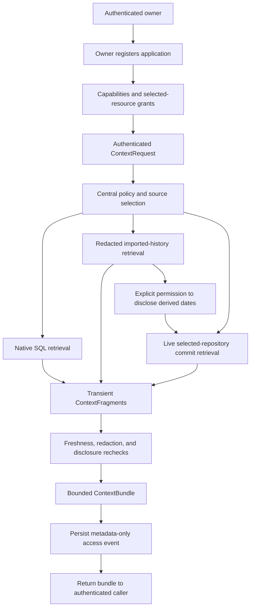

# Post-Phase-5 architecture and product review

Review date: 2026-09-25. This review covers the working tree containing Phases 1 through 5, including the GitHub implementation recorded on 2026-09-24. It does not introduce application changes, migrations, providers, or a Phase 6 implementation.

Subsequent implementation and pending live checks are recorded separately in [End-to-end validation](END_TO_END_VALIDATION.md). This review retains the findings and measurements of its original checkpoint.

## Finding and evidence standard

OpenMemory has a coherent context-resolution core, but it has not yet demonstrated a coherent end-to-end product. Ownership, explicit source authority, transient evidence, and partial-result reporting compose successfully. The missing proof is whether an independently written application can obtain useful evidence from real data, explain its limits, and use it within the owner's intended disclosure boundary.

The recommended next milestone is **live end-to-end validation with one local consuming application**. This includes the first real GitHub account exercise. It does not include another provider, a general SDK, automatic extraction, or permission to send bundles to a remote model.

The earlier Phase 5 conclusion, VALIDATED, remains a dated conclusion about a bounded provider experiment. At the whole-system level, **MODIFY** is the appropriate architectural conclusion: retain the resolver, but address the demonstrated integration and contract weaknesses before generalizing federation. Passing adapter tests does not establish product usefulness or production safety.

Evidence in this review has four distinct strengths:

* Code inspection establishes implemented control flow and storage behavior, with links to the relevant files below.
* Existing synthetic regression tests establish the cases those tests exercise. The review reran 99 resolver and GitHub tests, passing 697 assertions.
* A temporary synthetic probe measured six resolver scenarios against SQLite in memory, with all GitHub HTTP calls mocked. The probe passed 19 assertions and was removed after measurement.
* Live GitHub behavior, PostgreSQL concurrency, realistic retrieval quality, independent onboarding, and production operations remain unvalidated. Proposed experiments are not reported as completed results.

The [Phase 5 implementation report](GITHUB_IMPLEMENTATION.md) records the earlier full baseline: 613 backend tests, 41 frontend tests, five CLI tests, six disclosure-security tests, syntax checks, and a production frontend build. Those are historical results, not a new full-suite run for this documentation review. No personal archive or real provider credential was inspected.

### Findings that should determine priorities

| Finding | Evidence and consequence |
|---|---|
| F1. Application receipt does not authorize model use. | Every bundle declares `onward_disclosure: not_authorized`. No application grant describes an onward model recipient. A remote-model application therefore lacks a complete supported authorization workflow. |
| F2. The product has several independent memory paths. | Native Memory, imported history, graph/canister memory, Chat retrieval, and MCP do not form one application workflow. The existing Chat and MCP paths do not consume ContextBundle. |
| F3. Shared planning contains the first provider's assumptions. | ContextRequest fixes the history-to-GitHub temporal pair. ContextPlan assumes one connection, selected resources, a short date window, and an empty external query for every federated source. |
| F4. Bounded responses still require excessive database work. | The synthetic three-source application request performed 619 SQL queries for 20 fragments. Repeated policy, binding, resource, and provenance checks dominate the query count. |
| F5. Repository selection is larger than addressable retrieval. | Owners can select 20 repositories, but resolution always takes the first three authorized resource UUIDs. Requests cannot select a subset or advance a repository cursor. Later repositories can remain perpetually unsearched. |
| F6. The temporal experiment can answer the wrong interpretation. | It uses the first ranked dated history message and default-branch commit dates. It neither identifies all relevant discussions nor proves that the connected owner authored the commits. |
| F7. Auditing does not fully describe outbound disclosure. | The resolver writes its access event after retrieval. A process or database failure can occur after dates were sent to GitHub but before that event exists. Events also omit repository and temporal-anchor identity. |
| F8. Retention and portability stop short of account lifecycle. | Native export is useful, but not a whole-account export. Raw history is retained unencrypted by default, disconnected identities and expired application registrations have no pruning policy, and account erasure is not implemented. |
| F9. Consumer independence is incomplete. | Consumers can display fragment text generically, but source-specific provenance is needed for citations, timestamp interpretation, and some failure recovery. No application-facing capability discovery exists. |

## 1. Phases 1 through 5 as one system



The diagram describes the successful resolver path. Outbound provider requests happen before the final audit insert. Denials and authentication failures take separate paths; not every malformed or unknown-token request creates a context audit event.

| Stage | Current implementation | System-level implication |
|---|---|---|
| Owner identity | [User](../../app/app/Models/User.php) generates an owner UUID and a unique corpus binding. [SetAuthenticatedOwner](../../app/app/Http/Middleware/SetAuthenticatedOwner.php) establishes browser scope. | Provider IDs and corpus strings cannot authenticate an owner. The operator remains trusted to bind existing namespaces correctly. |
| Application identity | [ContextApplications](../../app/app/Services/Context/ContextApplications.php) creates an owner-bound registration and a one-time bearer token. Only its SHA-256 hash is stored. | Registration is an owner action, not application self-registration or OAuth consent negotiation. |
| Grant | Capabilities, resource UUIDs, expiry, revocation, and grant revision live on the application row. | There is no separate grant entity to administer. The permission vocabulary nevertheless exposes several overlapping concepts. |
| Context request | [ContextRequest](../../app/app/Services/Context/ContextRequest.php) validates version, query, sources, dates, limits, and the optional temporal operation. | Clients choose sources explicitly. There is no autonomous planner, semantic intent inference, or capability negotiation. |
| Source selection | [ContextPolicy](../../app/app/Services/Context/ContextPolicy.php) intersects operator enablement, caller authority, owner selection, and application resource grants. | Query text cannot expand authority. Source ordering comes from the registry, not the client's ordering. |
| Retrieval | [NativeMemorySource](../../app/app/Services/Context/NativeMemorySource.php) reads active assertions; [HistorySource](../../app/app/Services/Context/HistorySource.php) reads redacted active-path messages; [GitHubSource](../../app/app/Services/GitHub/GitHubSource.php) lists bounded commits. | These sources have different search and time semantics despite sharing one request envelope. Raw history is absent from resolver retrieval. |
| Normalization | Each adapter returns [ContextFragment](../../app/app/Services/Context/ContextFragment.php) through SourceResult. | Text, source identity, rank, trust, and provenance share a shape. Provenance semantics remain source-specific. |
| Disclosure | [ContextResolver](../../app/app/Services/Context/ContextResolver.php) checks recipient authority before retrieval and again afterward, validates current records, and redacts excerpts. | Retrieval permission alone cannot produce disclosed evidence. Rechecks reduce stale authority but cannot recall already transmitted data. |
| Bundle | The resolver interleaves sources, applies size limits, and returns fragments with source outcomes. | Partial provider failure preserves eligible local evidence. An application-wide authorization change instead aborts the request. |
| Audit | [ContextAudit](../../app/app/Services/Context/ContextAudit.php) records identity, operation, source statuses, counts, duration, and time. | It records an access decision, not proof that the recipient received the response or a complete ledger of outbound provider activity. |

The useful separation is between intentionally saved assertions, historical evidence, and transient external evidence. Combining these stores would weaken lifecycle semantics. The redundant separation is between competing application entry points that all appear to offer “memory” but use different storage, credentials, retrieval policies, and guarantees.

ContextCaller and SourceAccess justify their existence because authority must not come from caller-supplied evidence. ContextBundle is only a readonly array wrapper, so its apparent type safety exceeds its actual schema enforcement. ContextPlan returns either a request or a SourceResult, placing planning rejection inside a retrieval-result abstraction. Those are cleanup candidates, not reasons to replace the resolver.

## 2. The central thesis

The statement “an open-source context runtime that gives applications permission-controlled access to a person's memory and external digital context without requiring that context to be centralized” is defensible as a description of the implemented direction, with explicit qualifications.

Native Memory and the resolver operate locally without a model, cloud service, ICP, or federation. Applications receive separately authorized evidence from a common endpoint. GitHub content remains authoritative upstream, is retrieved on demand, and is not persisted as memory. These are substantive implementation properties rather than architectural promises.

However, imported conversations are deliberately copied into local SQL, including optional raw originals. The system avoids requiring centralization of **all** sources; it does not avoid local custody of sensitive content. Disclosed excerpts also reach the consuming application, which can retain them independently.

“A person's context” does not mean a complete personal record. Local retrieval is lexical and bounded. GitHub supplies default-branch commit metadata, not working-tree activity, all branches, issues, or an authenticated account of personal effort. Commit timestamps and messages do not prove when work occurred or what a change accomplished.

The thesis becomes misleading if it implies that the existing MCP interfaces already expose this runtime, that model use follows automatically from an application grant, or that self-hosting removes trust in the host operator. None of those claims is supported.

## 3. Developer experience

A minimal integration currently requires the following workflow.

| Step | What a developer must do | Assessment |
|---|---|---|
| Register an application | Ask the owner to sign in, open `/applications`, name the application, and copy its one-time token into the consuming application's secret storage. | This works for a personal installation. There is no redirect-based consent, self-service registration, or token rotation flow. |
| Request appropriate permissions | Communicate the exact capability names and, for GitHub, the repositories the owner must first connect and select. | The application cannot submit a permission request for owner review through a defined protocol. Setup depends on instructions outside the API. |
| Resolve context | Send JSON to `POST /api/app/context/resolve` with the bearer token, version, query, sources, and bounds. | One endpoint is sufficient after setup. Owner APIs and session cookies are unnecessary for consumption. |
| Interpret the bundle | Check HTTP status, version, `sources`, `incomplete`, and `truncated` before using `fragments`. Treat fragment content as untrusted data. | This is manageable with an example, but requires more care than iterating an array of text. |
| Distinguish partial results | Preserve eligible fragments while reporting failed, denied, unsearched, or incomplete sources. | An empty array alone cannot distinguish absence from failure. Unknown future statuses must be treated conservatively. |
| Use provenance | Keep source and resource identity with each excerpt. Interpret source-specific provenance to construct citations and explain timestamps. | Generic text display works; uniform citations and freshness display do not yet have a common contract. |
| Handle revoked permissions | Stop using the token after HTTP 401. Treat HTTP 403 during a request as lost authority. Handle source-specific denial inside successful HTTP responses. | Do not retry indefinitely or silently fall back to the owner's session. Permission removal can produce a source denial without revoking the token. |
| Avoid provider coupling | Use common fragment content and source outcomes; isolate optional provenance rendering. | GitHub retrieval setup still requires explicit dates or a GitHub-specific temporal plan. A source-neutral consumer can read results more easily than it can formulate requests. |

A local-only request can be as small as:

```http
POST /api/app/context/resolve
Authorization: Bearer <application-token>
Content-Type: application/json

{
  "version": "context-request-v1",
  "query": "portability",
  "sources": ["native_memory", "history"],
  "limit": 6,
  "per_source_limit": 3
}
```

This requires `context.resolve`, `memory.read`, `memory.disclose`, `history.search`, and `history.disclose`. An application needing only Native Memory should request only the first three. Token lifetime defaults to 30 days and can be set to at most 365 days during registration.

The largest product gap appears after successful retrieval. The response permits delivery to the application and explicitly denies onward disclosure. Operator model-operation configuration and History Ask consent belong to different workflows; neither authorizes a third-party application to forward this bundle. A local evidence viewer is supported. A remote-model assistant must not infer permission from the application's name or the owner's GitHub connection.

Proposed simplifications, without implementation, are a single integration guide, human-readable permission recipes that expand into explicit checks, an effective-access preview, and a versioned machine-readable schema with conservative handling of unknown outcomes. An application capability/authority description may eventually remove trial-and-error requests. An SDK should follow one independent integration rather than freeze today's awkwardness.

## 4. Owner experience

| Owner task | Present workflow and understanding required | Friction or ambiguity |
|---|---|---|
| Create and inspect memory | Sign in and use `/native-memory` for deliberately saved private assertions. | The separate Memory, Chat, graph, and MCP surfaces make the authoritative store difficult to identify. |
| Correct memory | Edit in place with a revision, or supersede it with a replacement record. | Correction does not preserve an edit history; supersession does. That distinction needs a plain explanation. |
| Delete memory | Delete the native record and understand that downloaded exports and recipient copies survive. | Deletion does not issue a portable tombstone or erase external copies. |
| Export memory | Export Native Memory in pages and keep writes paused for a consistent transfer. | The owner must understand pagination and distinguish a memory export from an account backup. |
| Register an application | Create a name, select capabilities, copy a one-time token, and configure another program. | Token loss requires another registration; there is no familiar connect-and-approve flow. |
| Understand permissions | Interpret raw capability names, read/disclose pairs, source resources, and expiry. | Several checkbox combinations are valid but produce no usable evidence. The UI lacks an effective-access explanation. |
| Connect GitHub | Create a fine-grained token on GitHub, select permissions there, paste it into OpenMemory, and enter expiry. | The owner manages two permission systems and a manually entered UTC deadline. Connection identity is verified, but permission breadth is not certified. |
| Select repositories | Discover repositories, page through results, then save explicit selections. | Available on GitHub, selected by the owner, granted to an application, and searched in one request are four different sets. |
| Authorize cross-source disclosure | Enable history-derived dates on the connection and grant the application's corresponding capability. | A date is sensitive derived information, but the raw capability name does not explain the concrete outbound disclosure. |
| Inspect access | Open recent application events and interpret source statuses and application UUIDs. | The latest 100 events lack friendly explanations, repository detail, and the date-window provenance needed to understand the temporal experiment. |
| Revoke access | Remove capabilities/resources or revoke the application token. | This stops future authorized requests, not use of plaintext already obtained. A removed resource UUID can remain in an application's stored grant list until edited. |
| Disconnect GitHub | Disconnect the owner connection, removing its credential and resource selections. | The token remains valid at GitHub unless separately revoked there. Reconnecting does not restore old resource grants. |

The interface is usable by a developer who understands the architecture, but not yet self-explanatory to a normal owner. There is also no owner-facing resolver preview that shows the selected evidence, excluded sources, and actual outbound date window before a real consumer is involved. Account creation remains an operator CLI task, and account erasure lacks a complete product workflow.

## 5. ContextBundle evaluation

The bundle is not inherently too large for an HTTP response. The complete encoded envelope is limited to 32,768 bytes, fragment allocation has a separate 24,000-byte budget, and no more than 20 excerpts of 600 characters can be returned. These are byte and character bounds, not a model-token budget. Repeated provenance can cost more space than the excerpts it describes.

| Contract question | Assessment |
|---|---|
| Is provenance understandable? | Native revision, history message location, and GitHub commit identity are useful evidence anchors. There is no common human-readable citation or title, and GitHub repeats connection/account/resource metadata on each fragment. |
| Can consumers distinguish incomplete knowledge from no matches? | Yes, within the declared bounded search, if they inspect source outcomes. `no_matches` means no eligible matches in that scope. It does not prove that a topic never occurred. |
| Are outcomes expressive enough? | Rate limiting, unavailability, disconnected sources, denied disclosure, no matches, pagination limits, and mixed failures are distinguished. Upstream 404 cannot establish whether a repository was deleted or access was removed; upstream 401 cannot reliably separate revocation from expiry. |
| Are the flags intuitive? | `truncated` can be true because an excerpt was clipped while `incomplete` is false. `searched` can be true when a provider attempt was stopped by a locally known expired credential or cooldown. It is not a network-call counter. |
| Are timestamps clear? | GitHub distinguishes `commit_time` from `retrieved_at`. Native dates describe record creation/update, history dates describe message events/storage, and bundle `resolved_at` describes assembly. There is no universal event-time or per-fragment retrieval-time field. |
| Is implementation detail exposed? | Candidate limits, scopes, raw capability names, source-resource UUIDs, connection UUIDs, and repository-level diagnostics appear in the response. Some explain coverage; some exist primarily for policy/debugging. |
| Does authorization leak? | Credentials and the complete grant set are absent. The audience/application ID and GitHub connection/account/resource identifiers reveal authorized relationship metadata. Their necessity for every consumer has not been established. |
| Is temporal reasoning explainable? | Coverage names the first-ranked-history strategy, but does not include a common dependency reference and chosen window. The anchor can also fall outside the final global fragment limit even though its date constrained GitHub. |
| Can the contract grow? | Textual summaries from email or files could fit. Event intervals, recurrence, image references, spatial metadata, and provider-generated answers need additional semantics. Arbitrary provenance alone would move that complexity into consumers. |

No contract is changed by this review. Proposed future changes should be reviewed separately: a small common citation/freshness projection, a generic outcome category plus optional provider diagnostic, explicit bounds/dependency information, and a published schema/version compatibility policy. Provider-specific provenance should remain available where it contributes evidence. Do not flatten distinct event times into one misleading timestamp.

## 6. Provider abstraction evaluation

The two-method [ContextSource interface](../../app/app/Services/Context/ContextSource.php), `search` and `isCurrent`, accepted GitHub without changing its signatures. Resolver assembly does not contain GitHub HTTP paths or parse commits. That is a useful architectural result.

The generalization is narrower than the interface suggests. [ContextSources](../../app/app/Services/Context/ContextSources.php) statically names GitHub capabilities and authority requirements; capabilities are registry declarations, not a provider discovery contract. ContextRequest names exactly `history` and `github` for temporal use. ContextPolicy constructs a directed capability string and uses a hard-coded resource limit of four, including the sentinel for a three-repository query. ContextPlan puts Git's 1970-to-2099 window, a 31-day maximum, a single connection, and empty external natural-language input behind the general label `federated`.

Provider-specific owner configuration, token handling, repository validation, and UI labels belong outside the core and are appropriately separate. A source-specific temporal strategy disguised as universal external planning does not. Authorization is centrally defined but repeatedly invoked by the planner, adapter, and resolver, with provider freshness checks overlapping resource policy checks.

| Thought experiment | Assumption that would fail |
|---|---|
| Email | A date window alone does not express sender, recipient, thread, or attachment scope. One owner may connect several mailboxes. Message time is not enough to express thread context or shared-mailbox permissions. |
| Calendar | Events have intervals, time zones, all-day semantics, recurrence, exceptions, and attendee privacy. A point event timestamp and lexical excerpt cannot represent those accurately. |
| Photos | An image is not its caption. Capture time can be absent or wrong, and a useful request may require location, a thumbnail, or an explicitly authorized transformation. No binary/thumbnail disclosure contract exists. |
| Drive and local files | File identity, version, path, file-system permissions, deletion, and symlink safety matter. A local source may need neither external identity nor an encrypted credential. “Federated” cannot simply mean one remote account with repository-style selections. |
| Provider-side intelligent retrieval | An external semantic search may need minimized terms or structured concepts rather than an empty question plus dates. Generated answers need a distinction from quoted evidence, explicit transformation provenance, and possibly model-processing consent. |

Another text provider could plausibly implement the same interface. A general provider platform has not been validated. The next abstraction change should follow an observed requirement, not a speculative universal connector design.

## 7. Permission-model evaluation

The security model has a coherent intersection: owner identity, enabled source, valid application, retrieval capability, recipient-disclosure capability, selected resource, application resource grant, and current revisions. History-derived dates add both connection consent and an application-specific directed grant. Neither Native Memory nor GitHub authority implies the other.

The owner experience risks permission explosion. For N sources, read/disclose permissions grow roughly linearly, while arbitrary directed cross-source permissions could grow as N multiplied by N minus one. Resource lists multiply the configuration burden further. The current single history-to-GitHub edge is understandable in isolation; replicating its raw checkbox vocabulary would not be.

There are also overly broad dimensions: local source grants cover all eligible existing and future native records or imported messages. There is no conversation subset, purpose restriction, or lifetime extraction budget. Repository resources are narrower, but three-repository scheduling makes that finer scope awkward to use.

A simpler proposed presentation is one permission card per application and source, stating the resource set and the permitted recipient. The owner could approve “return commit excerpts from these repositories to this application,” which expands into the existing retrieval and disclosure checks. Advanced inspection must still show those distinct checks; a UI recipe must never create implicit authority.

Cross-source disclosure should remain separately visible as a concrete transformation: “use dates found in selected history evidence to query these GitHub repositories.” An application may use this only when both the owner connection policy and its own permission allow it. Display effective authority as the intersection, so the owner does not have to mentally combine two screens.

Do not add a general information-flow language. The existing mechanism controls dates derived inside this runtime, not the behavior of an application that has already received history. Such an application can construct an explicit date request itself or send plaintext elsewhere. Policy and contractual expectations remain necessary after disclosure.

## 8. Manual live-system validation checklist

Use a disposable OpenMemory installation and a GitHub account the tester is authorized to use. Use small test repositories containing fabricated notes, including one private repository and one accessible but deliberately unselected repository. Existing harmless commits are sufficient; no important repository needs deletion, force-push, or permission changes. Keep credentials, exports, screenshots containing private data, and full bundles outside this repository.

Create a short-lived fine-grained PAT for only the test repositories, with Contents read and required Metadata read. GitHub documents the [fine-grained token restrictions and lifecycle](https://docs.github.com/en/authentication/keeping-your-account-and-data-secure/managing-your-personal-access-tokens). OpenMemory verifies `/user`, but its token-prefix check does not certify that the token has no extra permissions. Organization approval and account-policy restrictions should be recorded as environmental results rather than bypassed with a broader token.

Use the owner browser session for connection management. Use a small local HTTP client with in-memory secret input for application requests. Disable request/response body and authorization-header logging. Observe outbound method/path, request count, status, and timing only; if verifying query minimization, inspect only the synthetic test's parameter names and fabricated dates in an isolated local debugger. Do not enable general payload tracing.

For each row, record pass/fail/not-run, the application revision being exercised, request ID if returned, source outcomes, outbound request count if observable, elapsed time, and any mismatch. Retain private evidence locally only when necessary for diagnosis. A missing observation must not be marked as a pass.

| Check | Procedure | Expected behavior |
|---|---|---|
| Connection and identity | Connect the limited token at `/sources/github`; compare the displayed account with GitHub settings. | GitHub supplies the account ID/login. The signed-in OpenMemory owner remains unchanged, and no repositories become selected automatically. |
| Ownership isolation | Sign in as another local test owner and inspect the source page or attempt the known connection URL. | The second owner cannot inspect or mutate the first owner's connection. A matching name or provider login creates no authority. |
| Repository discovery | Request discovery and advance available pages without saving selections. | Discovery returns accessible repository identities, exposes pagination, and creates no context grant. It may stop after ten pages of 30 results. |
| Explicit selection | Select one public and one private test repository while leaving another accessible repository unselected. | Only saved selections are eligible. Entering the unselected repository name in query text cannot add it. |
| Owner resolution | Submit a GitHub-only request with a UTC window of at most 31 days containing a known default-branch commit. | The result includes its SHA, message excerpt, repository, provider URL, commit time, and retrieval time. It contains no token or file body. |
| Date and author semantics | Compare returned commits with GitHub's default-branch history, including a harmless commit by another contributor if available. | The result is repository activity, not an assertion that the connected owner performed every change. Record absent author identity without inventing it. |
| Private repository | Resolve the private selection with the same date window. | Authorized metadata is returned with the same untrusted/private treatment as other evidence. It never appears through unauthenticated, MCP, or another-owner access. |
| Scope denial | Register an application with GitHub capabilities but no repository grants, then with only one selected resource. | The first request is resource-denied. The second queries only its authorized selected repository. |
| Application success | Grant `context.resolve`, `github.commits.read`, `github.disclose`, and one repository UUID. Use the bearer endpoint. | The same bundle contract works without owner cookies or GitHub credentials in the consumer. |
| Independent source grants | Give a second application Native Memory permissions only; request both Native Memory and GitHub. | Native evidence can succeed while GitHub reports unauthorized and receives no query. Reverse the grants and verify Native Memory remains unavailable. |
| Retrieval without disclosure | Remove `github.disclose` while retaining retrieval permission. | GitHub is not queried, and its outcome is `disclosure_denied`. |
| Temporal success | Import a fabricated dated history message using the existing local importer, save a matching native statement, and enable both connection date consent and the application cross-source grant. Request all three sources with a temporal window of one to seven days. | A history anchor determines bounded dates. Outbound GitHub parameters contain repository/path, dates, and pagination, not the private sentence. Applicable evidence appears in one bundle. |
| Temporal denial | Disable connection date consent, then separately restore it and remove the application's cross-source grant. | Each configuration blocks the history-derived query with `query_disclosure_denied`, while permitted local evidence survives. |
| Missing temporal anchor | Query a fabricated phrase absent from history, or use only an undated matching message. | GitHub is not queried and reports `temporal_anchor_unavailable`. Absence is not represented as a successful GitHub search. |
| No matching commits | Use a known empty time interval on an otherwise accessible nonempty repository. | GitHub reports `no_matches` when all eligible pages are covered. An empty repository may instead report `repository_empty`. |
| Pagination and bounds | Use a disposable repository with more than 20 harmless commits in the window, if available; select more than three test repositories only when convenient. | Coverage reports truncation/incomplete search. There are at most two commit pages per queried repository and three repositories per resolution. Document the fixed-subset limitation. |
| Revoked application | Revoke the test registration and repeat its bearer request. | Authentication fails with HTTP 401 before GitHub retrieval. Other applications and owner access remain independent. |
| Grant change in flight | If a controlled local debugger is available, pause between provider operations and remove the grant. | A subsequent checkpoint blocks further authorized work and suppresses evidence. Record the checkpoint observed; do not claim atomic cancellation of an already sent HTTP request. |
| Repository deselection | Deselect a test repository without changing its GitHub permissions. Repeat the application request, then reselect it. | The deselected repository is not queried. Reselection requires a new resource grant rather than silently restoring the old UUID's authority. |
| Upstream access removal | Remove one disposable repository from the PAT's GitHub repository selection. | The source reports inaccessible/denied or a mixed failure; other permitted local sources remain usable. The result must not claim to know whether deletion or permission removal caused an ambiguous 404. |
| Locally known expiry | Connect a disposable valid token with a deliberately short future local expiry, then test after that deadline. | GitHub reports `credential_expired` without a new provider call. This tests local expiry, not GitHub's actual token expiry clock. |
| Upstream revoked or expired token | Revoke only the disposable PAT at GitHub, or wait for its real expiry, then resolve. | A rejected token produces `credential_invalid`; the stored credential is cleared after a 401. Record actual upstream expiry as not-run unless observed. |
| Disconnection | Disconnect GitHub, resolve again, and then attempt access with the old application grant. | Credentials and selections are removed; future retrieval reports disconnected without contacting GitHub. Native Memory remains available. Reconnect only with fresh explicit selections/grants. |
| Unavailable provider and partial results | In the disposable installation, temporarily block its outbound GitHub connection without affecting local SQL, then request all sources. | Local fragments survive. GitHub reports unavailability or timeout distinctly from no matches. Restore network access after the check. |
| Rate limiting | Observe a naturally occurring limit if available, respecting retry/reset headers. Otherwise use the existing synthetic rate-limit tests and mark the live case not-run. | The result reports `rate_limited`; later requests honor the stored cooldown. Never exhaust a real account's quota merely to generate a test result. |
| Injection, logs, and retention | Put an obviously fabricated instruction-like commit message in a disposable repository, resolve it, and inspect only test artifacts and operational metadata. | It remains untrusted text. No model/tool execution occurs; tokens, commit bodies, and bundles are absent from ordinary logs, audit rows, and Native Memory exports. |
| Audit cleanup and local independence | Run `php artisan context:audit:prune` in the disposable installation with synthetic old events. Disable GitHub and model credentials, then create, export, import, and resolve Native Memory. | Old audit metadata is pruned after the documented threshold, and the local workflow works without federation, cloud, or ICP. |

For the temporal request, use `sources: ["native_memory", "history", "github"]`, omit explicit `from` and `to`, and set `temporal: {"from_source":"history","to_source":"github","days":2}`. The two modes are mutually exclusive. Commit-list defaults and supported date bounds are documented by [GitHub's commit API](https://docs.github.com/en/rest/commits/commits#list-commits); upstream rate handling should follow [GitHub's rate-limit documentation](https://docs.github.com/en/rest/using-the-rest-api/rate-limits-for-the-rest-api).

## 9. Product usefulness experiment

These are proposed tasks, not claims about any person's actual history. Use owner-authorized records that genuinely exist, or clearly labelled fabricated records for control cases. Do not manufacture evidence to make a query succeed.

Every application request requires `context.resolve`. For the table, N additionally requires `memory.read` and `memory.disclose`; H requires `history.search` and `history.disclose`; G requires `github.commits.read`, `github.disclose`, an active owner connection, and a selected repository also granted to the application. T additionally requires connection permission for history-derived dates and `history.query_disclose.github`. These source permissions are independent, and none authorizes onward model disclosure.

| Realistic query | Sources and authority | Expected context and contribution to a task | Useless or misleading result |
|---|---|---|---|
| 1. “Before proposing a storage change, remind me of the portability constraints I saved.” | Native Memory requires N. | Active saved constraints help a coding agent avoid an incompatible proposal. A query using the actual stored term can test basic utility first. | The response returns only archived/superseded claims, generic keyword matches, or nothing because the request used a synonym. |
| 2. “What did we decide about SQLite support, and what reasoning led there?” | Native Memory and history require N and H. | A current assertion plus dated discussion separates the decision from its original rationale. | The bundle repeats an old assistant suggestion as the current decision or lacks a relevant rationale excerpt. |
| 3. “What was I working on around the time I discussed OpenMemory portability?” | History and GitHub require H, G, and T; Native Memory optionally adds N. | A dated discussion and nearby selected-repository commits help reconstruct a work period. | An unrelated highest-ranked discussion anchors the window, or other contributors' commits are presented as the owner's work. |
| 4. “Which selected-project commits landed between Monday and Friday?” | GitHub requires G and caller-supplied UTC dates. | Commit identities and timestamps provide a bounded starting point for a weekly change summary. | The answer implies all branches, all repositories, or personal authorship despite incomplete/default-branch coverage. |
| 5. “Does the work around our export-format discussion line up with the portability constraint I saved?” | All three sources require N, H, G, and T. | The application can juxtapose an assertion, a discussion, and commit descriptions before deciding what to investigate. | Similar words are treated as proof that implementation satisfies the constraint; commit metadata cannot establish code correctness. |
| 6. “Find the discussion where we rejected automatic memory extraction.” | History requires H. | Original dated messages help an assistant avoid reopening a resolved design debate. | The query finds a quoted hypothetical or one isolated sentence without enough context to establish a rejection. |
| 7. “Prepare a review checklist from my saved release rules and last week's repository changes.” | Native Memory and GitHub require N and G with explicit dates. | Current rules and concrete commit descriptions improve a human-reviewed checklist. | Applying the date range to all sources hides older still-active native rules. This currently needs separate requests or careful bounds. |
| 8. “What changed after the discussion of application-token revocation?” | History and GitHub require H, G, and T for the approximate temporal experiment. | Nearby commits can identify changes worth inspecting manually. | The symmetric temporal window includes earlier work and is misrepresented as an exact “after” query. This exposes a current expressiveness limit. |
| 9. “Which project was active when I discussed the migration deadline?” | History and GitHub require H, G, and T across relevant selected repositories. | Repository references attached to nearby commits can suggest a likely project. | The relevant repository is fourth in UUID order and never searched, or timing alone is asserted as a causal connection. |
| 10. “GitHub is unavailable; give me the saved constraints and prior discussion needed to continue the portability review.” | Native Memory and history require N and H; a GitHub attempt requires G and a bounded mode. | Local evidence remains useful while the bundle explicitly reports missing live coverage. | The consumer discards every source on one provider failure or claims there were no recent changes. |

For each task, record the user's intended scope before seeing results, a manually verified useful evidence set, returned relevant and irrelevant fragments, missing evidence, setup effort, and whether the application could explain each omission. Repeat at least one query with a synonym, one with several plausible history anchors, and one across a repository larger than the page limit. Controlled fixture vocabulary currently hides these failure modes.

A useful result must change a concrete application action, such as preserving a saved constraint or locating a relevant commit, and must retain enough provenance for owner verification. Text that merely mentions the query term does not satisfy that criterion. A remote model is unnecessary for this experiment; a local application can display and organize evidence for the owner.

## 10. Performance and bounded behavior

The temporary probe called the real ContextRequest parser and ContextResolver directly. It used one synthetic owner, 10,000 native rows, 1,000 imported message rows from fabricated fixture text, 100 lexical matches in each local source, three selected repositories, and a fully granted application. Every repository supplied two mocked pages of ten commits, with a further-page marker. It requested at most 20 fragments and ten per source.

Each scenario ran once to warm the code and five more times for measurement. SQL counts came from Laravel's query listener; no bindings or payloads were printed. Figures include request parsing, resolver redaction/rechecks, and the audit insert, but exclude HTTP authentication/session middleware, real network latency, disk/database-server latency, and data setup. Times are illustrative single-machine measurements, not service-level promises.

| Scenario | Median elapsed time | Five-run range | SQL queries | Mocked external requests | Fragments | Encoded bundle bytes |
|---|---:|---:|---:|---:|---:|---:|
| Owner, Native Memory | 9.46 ms | 9.14 to 10.23 ms | 22 | 0 | 10 | 5,661 |
| Application, Native Memory | 11.32 ms | 11.04 to 11.76 ms | 36 | 0 | 10 | 5,701 |
| Application, history | 13.10 ms | 12.41 to 13.38 ms | 48 | 0 | 10 | 7,123 |
| Application, GitHub | 44.30 ms | 43.50 to 45.52 ms | 380 | 9 | 10 | 10,257 |
| Application, all sources with temporal planning | 89.01 ms | 87.47 to 95.98 ms | 619 | 9 | 20 | 15,183 |
| Application, local no-match request | 7.15 ms | 6.80 to 7.72 ms | 30 | 0 | 0 | 1,006 |

The first five scenarios honestly reported incomplete search because the fixture exceeded return/page limits. The final scenario reported local `no_matches`. The GitHub fixture deliberately used unrelated commit messages and still returned them, confirming that this capability is date-bounded listing rather than topical commit search.

Sources execute sequentially in registry order. History must precede GitHub for the temporal operation, but independent Native Memory and explicit-date GitHub requests also wait sequentially. The final response waits for the provider even when local evidence is already available. There is no streaming partial response.

| Bound | Actual behavior and remaining cost |
|---|---|
| Incoming request | JSON input is limited to 16 KiB, with a query of at most 500 characters and at most three named sources. |
| Local candidates | Each local source considers at most 100 candidate records, fetching a sentinel to detect overflow. Leading-wildcard SQL matching can still scan a large owner corpus before applying that cap. |
| Local materialization | Native statements can be 8,000 characters; imported normalized messages can be much larger. One hundred 200,000-character messages could materialize roughly 20 million characters before excerpting, plus object/metadata overhead. Bundle size does not bound intermediate memory. |
| Repository selection | Up to 20 repositories can be selected, but only three are queried per resolution. Selection discovery permits up to ten owner-requested pages of 30 repositories. |
| GitHub requests | Resolution makes at most three repository metadata requests plus six commit-page requests. It can inspect up to 60 commits before returning at most ten GitHub fragments. Connection verification and owner discovery/selection are separate operations. |
| Provider time | The client configures two-second connect, five-second request, and one-second read timeouts, plus a streaming deadline. The source stops starting operations after its 25-second deadline. An operation begun just before that deadline can finish later; this is not a strict end-to-end 25-second SLA. |
| Provider response size | Each response is capped at 524,288 bytes. Nine maximal accepted responses total about 4.5 MiB of serialized bodies processed sequentially, with additional decoded-object overhead. No persistent content cache exists. |
| Time window | Explicit GitHub windows are at most 31 days within Git's supported date range. Derived windows extend one to seven days on either side of one history anchor. |
| Bundle size | Twenty fragments, ten per source, 600 characters per excerpt, a 24,000-byte fragment budget, and a 32,768-byte final envelope cap apply independently. An oversized final envelope fails with HTTP 503. |
| Repeated use | Route throttling and provider cooldown reduce bursts, but do not create a cumulative disclosure budget or per-owner global provider-work budget. Concurrent requests can race before cooldown state is recorded. |

A latency sensitivity calculation shows why the query count matters: 619 sequential database round trips at an additional one millisecond each would add about 0.62 seconds. Nine provider round trips at an assumed 200 ms each would add about 1.8 seconds. These are arithmetic scenarios, not measured PostgreSQL or GitHub timings.

The first scaling work should reduce redundant owner-binding, application, resource, and redaction-policy reads while preserving rechecks at real disclosure boundaries. A request-local authority snapshot with explicit refresh checkpoints deserves investigation. Blindly caching authorization for an entire request would weaken revocation. Lexical query plans, large-message materialization, and database latency should be measured before introducing parallelism or indexes; distributed infrastructure is not warranted.

## 11. Security review

MITIGATED means the inspected implementation and synthetic tests provide a specific control for the stated threat, not proof against every deployment error. PARTIALLY MITIGATED means a meaningful residual remains. ACCEPTED LIMITATION identifies a boundary this architecture cannot enforce after disclosure. UNRESOLVED identifies missing behavior or unvalidated guarantees that need explicit attention.

| Threat | Status | Evidence, residual risk, and required interpretation |
|---|---|---|
| Confused deputy through provider identity or owner spoofing | MITIGATED | Local authentication, immutable caller ownership, verified GitHub identity, separate application transport, and server-selected resources prevent identifiers or query text from granting owner authority. The host operator remains trusted. |
| Unauthorized runtime-derived cross-source query | MITIGATED | Both connection consent and the application's directed grant are required before history-derived dates leave. Natural-language history text is removed from the provider request, and the anchor is rechecked. |
| Cross-source information flow after application receipt | ACCEPTED LIMITATION | An application with disclosed history can derive its own dates or transmit plaintext elsewhere. Explicit-date requests carry no verifiable proof of where their dates came from. |
| Application token theft | PARTIALLY MITIGATED | High-entropy tokens, hashed storage, expiry, route isolation, and revocation limit damage. A stolen bearer token is replayable within its grants; there is no sender binding or rotation workflow. TLS, application secret storage, and clipboard handling remain operational duties. |
| GitHub credential theft | PARTIALLY MITIGATED | Laravel encryption, hidden serialization, fixed API destinations, redacted exception handling, and token removal protect the normal paths. The running host can decrypt credentials with APP_KEY, and backups can retain old ciphertext. The token can have broader permissions than OpenMemory needs. |
| Repository-scope escalation and arbitrary proxying | MITIGATED | Owner selection, application allowlists, connection/resource revisions, stable repository IDs, fixed HTTPS endpoints, and disabled redirects constrain retrieval. Token access alone does not make a repository eligible. |
| Malicious commit messages or imported conversations | PARTIALLY MITIGATED | Retrieved text is marked as untrusted, rendered as data, and does not invoke a model or tools in the resolver. Downstream consumers must preserve this separation. A trust label cannot force an arbitrary model client to obey it. |
| Query-driven bulk extraction | PARTIALLY MITIGATED | Per-request limits, selected repositories, route throttles, and source grants constrain each call. A granted application can accumulate large amounts through repeated lexical/date queries, including future records admitted by a source-wide grant. |
| Raw-history custody and normalized metadata | PARTIALLY MITIGATED | Raw reads are owner-only and excluded from retrieval. Raw payloads are nevertheless plaintext database content by default. Redacted message bodies do not make titles, attachment labels, account labels, or provider metadata nonsensitive. |
| Audit-log sensitivity | PARTIALLY MITIGATED | Events omit query and fragment payloads, but application identifiers, timing, source use, and counts still reveal behavior. Thirty-day pruning depends on running the command/scheduler. Operators can reintroduce payload leakage through proxies, tracing, or database instrumentation. |
| Audit completeness for outbound disclosure | UNRESOLVED | Provider requests precede the final context audit insert. A crash or failed insert can leave an outbound date disclosure without a corresponding access event. Current events cannot reconstruct which repository/window was queried. This follows from control flow; a crash-recovery experiment was not performed. |
| Stale grants and revocation races | PARTIALLY MITIGATED | Grant revisions and repeated checks reject many mid-request changes. No database check can atomically cancel an already transmitted HTTP request or plaintext response. PostgreSQL multi-request races remain untested, and local record checks occur before final response delivery. |
| History deletion racing with import | UNRESOLVED | The owner delete route removes raw rows and then the conversation without a transaction. The raw foreign key uses `nullOnDelete`, not cascade. A concurrent import can potentially leave a preserved raw row detached from the deleted conversation. This is a code-inspection race risk, not a reproduced cross-owner disclosure. |
| Application retention of disclosed plaintext | ACCEPTED LIMITATION | Revocation and disconnection stop future authorized retrieval. They cannot delete recipient caches, logs, exports, screenshots, or model-provider records. No retained copy should be presented as current live authority. |
| Permission to use a remote model | UNRESOLVED | The current application contract always denies onward disclosure and offers no mechanism to authorize a named downstream model. Weakening this declaration would conceal the missing product primitive. |
| Production host compromise or internet exposure | PARTIALLY MITIGATED | Application checks depend on a trusted host and protected APP_KEY. Development defaults, exposed Compose ports, debug configuration, missing operational recovery validation, and optional agent execution are outside the resolver's protection. |

No tested application authorization bypass was found that required changing behavior during this review. This is not a penetration-test certification. The deletion race and outbound-audit gap should remain explicit findings, with targeted concurrency/failure tests before sensitive production use.

## 12. Data retention and deletion

In this table, “encrypted” means application-level encryption at rest, not optional full-disk/database encryption supplied by the host. “Exportable” describes the implemented product format or owner route, not an operator's ability to dump a database. Backups and recipient copies require separate deletion policies in every row.

| Data category | Persisted? | Why retained? | Owner or authority | Deletion behavior | Exportable? | Sensitive? | Encrypted? | Retention policy |
|---|---|---|---|---|---|---|---|---|
| Users and authentication fields | Yes. | They establish local accounts and login. | The local user and trusted operator control them. | There is no complete account-erasure UI/workflow. | They are outside Native Memory export. | Identity and authentication metadata are sensitive. | Passwords are hashed; identity fields are not encrypted. | No account-expiry/pruning policy is implemented. |
| Corpus owner bindings | Yes. | They connect authenticated accounts to legacy/import namespaces. | The trusted operator can explicitly bind a namespace. | A restrictive user foreign key prevents simple user deletion while a binding remains. Namespace data does not automatically follow user deletion. | They are outside the portable format. | The mapping reveals identity relationships. | They are not application-encrypted. | They persist until explicit operator intervention. |
| Native Memory | Yes. | It is the intentionally durable owner assertion store. | The owning user controls records. | Correction replaces content; supersession retains the old record; hard deletion removes it and repairs links. | The versioned native format includes lifecycle and provenance fields. | Statements are private personal content. | Content is not application-encrypted. | Records persist until explicit deletion; archival is not deletion. |
| Imported conversations and messages | Yes. | They provide local historical retrieval and inspection. | The owner's bound corpus namespace controls them. | Owner conversation deletion removes messages; removing an upstream conversation does not propagate automatically. | They are outside Native Memory export. Owner inspection is available. | Redacted bodies and metadata remain sensitive. | They are not application-encrypted. | They persist until owner deletion; re-import can restore source content. |
| Raw conversation records | Yes, by default; configurable for new imports. | They preserve exact originals for owner inspection and parser provenance. | The authenticated corpus owner has a dedicated raw route. | The controller explicitly deletes attached raw rows. Null-on-delete schema semantics and the race described above require care. Disabling future raw storage does not erase existing rows. | An owner can inspect the raw representation; it is not a portable account archive. | These can contain unredacted secrets and highly sensitive history. | Payloads are plaintext long text. | There is no automatic retention limit for originals or preserved versions. |
| Import records | Yes. | They track import provenance, source hash/path, status, counters, and diagnostics. | The corpus owner and operator control the import namespace. | Deleting one conversation does not remove the import record or original archive file. | They are outside the native format. | File paths, source labels, hashes, and diagnostics can be sensitive metadata. | They are not application-encrypted. | No general import-record pruning policy exists. |
| Applications and token hashes | Yes. | They identify recipients and authenticate bearer access. | The registering OpenMemory owner controls them. | Revocation marks the row; it does not erase the registration. | Credentials and registrations are excluded from exports. | Names, activity associations, and authentication hashes are sensitive. | Tokens are hashed, not reversibly encrypted. | Expired/revoked registrations have no automatic pruning policy. |
| Grants and resource UUID lists | Yes, on application/connection rows. | They define current retrieval, disclosure, and query-disclosure authority. | The owner grants; operator policy can only narrow enabled sources. | Grant replacement changes the revision; stale resource UUIDs can survive until the application is edited. | They are excluded from the native format. | They reveal relationships and intended access. | They are not application-encrypted. | Current rows persist; there is no complete historical grant ledger. |
| Context audit events | Yes. | They provide metadata about access decisions. | They are owner-scoped operational records. | The prune command removes rows older than 30 days. | The owner can inspect the latest 100 retained events; no portable full-audit export exists. | Timing, recipients, and source use remain sensitive. | They are not application-encrypted. | Thirty days is conditional on actually running pruning. |
| GitHub credentials | Yes, while connected and usable. | They authorize live provider calls. | The connection belongs to the local owner; GitHub governs upstream authority. | Disconnect clears the credential; a provider 401 clears it. Expiry alone blocks use but does not immediately erase ciphertext. | They never enter the native export or bundle. | They are authentication secrets. | Laravel's encrypted cast uses APP_KEY. | Credential ciphertext remains until cleared or connection data is replaced; backups can outlive both. |
| GitHub connection identity and operational metadata | Yes. | They identify the external account, revisions, consent, expiry, and cooldown. | The OpenMemory owner controls the connection. | Disconnection retains the connection/account metadata while removing credential and selections. | They are excluded from native exports. | Account linkage and access timing are sensitive. | These fields are not application-encrypted. | Disconnected connection metadata has no documented automatic expiry. |
| GitHub repository selections | Yes. | They enforce owner-approved resources with stable provider IDs. | The connection owner selects; applications receive a narrower allowlist. | Deselection and disconnection remove resource rows. Reselection creates new grant identities. | They are excluded from native exports. | Private repository names and associations are sensitive. | They are not application-encrypted. | They persist only while selected, apart from backups and stale grant UUIDs. |
| GitHub evidence | No content persistence in this provider. | It is needed only to answer the current request. | GitHub remains authoritative; the recipient controls any disclosed copy. | Request memory is released; no content cache or Native Memory copy is created. | It appears only as authorized transient evidence, not native export. | Commit text and repository associations may be private. | There is no at-rest payload in this path. | It lasts for the request unless a recipient or operator captures it. |
| ContextFragments | No. | They normalize evidence during resolution. | They inherit source ownership and recipient authority. | They are not independently stored or deleted. | They are included in authorized bundles only. | They can contain sensitive excerpts and provenance. | There is no at-rest payload in this path. | They are request-local objects. |
| ContextBundles | No. | They return bounded evidence to the caller. | OpenMemory controls disclosure; recipients control received copies. | Revocation cannot recall a returned bundle. | The response is serializable, but it is not the portable memory format. | The combined evidence can be more sensitive than an individual fragment. | There is no at-rest payload in this path; transport needs TLS. | Server retention is transient; recipient retention is outside enforcement. |
| Legacy chat, graph, evidence facts, document nodes, agents, and snapshots | Yes, when those paths are used. | They support earlier chat, graph, document, and research workflows. | Legacy corpus namespaces, local users, and optional canister principals govern different parts. | Controllers and graph maintenance have separate lifecycle rules; they are not an account-wide erase mechanism. | They are outside native portability. | Text, inferred structure, and interaction metadata can be sensitive. | Local content is not generally application-encrypted; canister storage has separate guarantees. | Several records persist indefinitely, while graph decay/pruning and snapshots have workflow-specific rules. |
| Legacy mock memory cache | Yes, temporarily. | It supports development continuity for the canister interface. | The host's configured cache and legacy namespace control it. | Cache expiry/clearing removes it independently of Native Memory. | It is outside native export. | Cached records can contain personal statements. | It is not generally application-encrypted. | The mock owner-memory write uses a two-hour cache lifetime. |
| Redaction policies, sessions, jobs, and operational logs | Yes, depending on enabled paths and drivers. | They support content policy, authentication, task execution, and diagnostics. | The owner controls applicable policies; the host operator controls infrastructure. | Framework expiry and operator cleanup apply; there is no unified personal-data erasure procedure. | They are outside native export. | Sessions, job payloads, and metadata can be sensitive even without ordinary content logging. | Password hashes and GitHub encryption do not encrypt these stores as a whole. | Retention depends on driver configuration, scheduler operation, and host log policy. |
| Original import files, downloaded exports, and backups | They can persist outside runtime-managed tables. | The owner/operator retains source archives, transfers, and recovery copies. | The filesystem owner or backup operator controls them. | Application deletion does not remove these independent copies. | They are already files or operator backups. | They may contain the most complete unredacted data. | Encryption depends on the owner/operator's storage practice. | No OpenMemory deletion guarantee extends to them. |

Most core persistence has a strong purpose. The questionable defaults are indefinite raw-version retention, indefinite disconnected identity metadata, and indefinite expired/revoked application records without a stated operational need. These should receive explicit owner/operator policies rather than being silently retained forever.

Portability also has specific limits. Native export is paged rather than a transactional snapshot, correction history is not retained, and deletion has no tombstone. An old export can reintroduce a deleted statement. Application credentials, connections, imported history, and audit data are deliberately absent. A separate backup/restore and account-erasure design is needed; calling the native format “complete portability” would overstate it.

## 13. Naming review

| Term | Assessment and proposed interpretation |
|---|---|
| OpenMemory | The name remains useful, but the README should explain the distinction between durable assertions and transient context early. |
| Native Memory | This accurately separates intentional owner assertions from imported evidence. An owner-facing description such as “saved memory” can explain it without renaming the API. |
| Context | This is useful as a bounded evidence set, provided it does not imply a complete account of the person. |
| ContextRequest | This is a reasonable developer term, though the shared query currently has different semantics across sources. |
| ContextFragment | This correctly describes an excerpt with provenance, rather than an independently durable memory. |
| ContextBundle | This is a useful response name. Its versioned schema should carry more weight than the current array wrapper. |
| Source | This should identify the evidence surface, such as active native assertions or imported messages. It currently also doubles as a provider key. |
| Provider | This should identify an implementation or external service. Archive-format providers and live GitHub federation are different concepts currently using similar vocabulary. |
| Connection | This correctly identifies an owner-authorized external account relationship. It should not become a requirement for local sources without credentials. |
| Application | This means an owner-registered recipient with an independent bearer identity. It should not imply that the application is approved for remote model use. |
| Grant | This is correct developer terminology. Owner screens should explain the concrete action and recipient instead of presenting only capability strings. |
| Retrieval | This means obtaining evidence within source authority. GitHub listing and local lexical search should not both be described simply as semantic search. |
| Disclosure | This means information crossing a recipient boundary. Application receipt, model transmission, and sending derived dates to GitHub are separate disclosures. |
| Provenance | This means origin and retrieval lineage. It does not certify truth, author intent, semantic correctness, or personal authorship. |

Renaming classes would not resolve the main confusion. The more important change is to reserve “durable memory” for a store with durable lifecycle guarantees and label the cache-backed legacy MCP path accurately.

## 14. Open-source Core and hosting boundary

A useful self-hosted Core exists in code: local account ownership, Native Memory lifecycle and portability, imported-history retrieval, application grants, and the resolver can run with local SQL and no model credentials or external provider. GitHub is optional. There is no OpenMemory Cloud, paid-service, vector-store, or ICP dependency in that core path.

Packaging does not communicate this cleanly. The supplied environment example defaults to PostgreSQL at a Docker service hostname. The previous SQLite quickstart omitted the database override and ran `artisan key:generate` before Composer dependencies were installed. The review's documentation refresh corrects those instructions. The default Compose stack still starts the optional ICP adapter and exposes development ports; it is not a minimal production Core deployment.

Operational independence also requires protecting APP_KEY, backing up local data, recovering the database, and arranging audit pruning. The Compose stack has no scheduler service. Running the complete Laravel schedule also runs older graph maintenance tasks, so an operator who wants only audit retention should understand the dedicated prune command.

Reasonable hosted-offering capabilities include managed upgrades, encrypted backup and restore operations, availability monitoring, managed TLS, capacity planning, operational alerting, and hosted account provisioning. Core must retain ownership enforcement, revocation, resource selection, native export/import, basic audit inspection, credential protection, and local operation. Security controls and the ability to leave cannot become paid escape hatches.

## 15. Competitive and standards reassessment

The following sources were checked on 2026-09-24 and 2026-09-25. They establish documented technical overlap, not comparative benchmark results. Public documentation can describe features ahead of general rollout, so future announcements are not treated as completed capabilities.

**Memory infrastructure already overlaps substantially.** Mem0 documents both a library and a self-hosted server with a dashboard, per-user API keys, and request auditing. Its configurable memory engine includes model, embedding, and storage components. OpenMemory cannot differentiate merely by being self-hosted memory with an API. Its narrower distinction is explicit owner assertions plus transient external evidence without requiring inference or embeddings for that path. [Mem0 open-source overview](https://docs.mem0.ai/open-source/overview).

**Temporal provenance is also established territory.** Graphiti builds temporal context graphs with changing facts, source episodes, and hybrid retrieval. OpenMemory's Phase 1-to-5 path avoids deriving a persistent knowledge graph from the evidence it resolves. This reduces inference and retention obligations, while giving up semantic relationship retrieval and richer temporal reasoning. The legacy graph in this repository should not be mistaken for the new runtime's source of truth. [Graphiti repository documentation](https://github.com/getzep/graphiti).

**MCP provides an integration protocol, not OpenMemory's complete evidence policy.** The current authorization specification addresses transport authorization for protected HTTP resources. It does not by itself define Native Memory lifecycle, the meaning of a ContextBundle, or history-to-provider date consent. An eventual resolver transport could use MCP, but existing OpenMemory MCP credentials and tools do not implement the new per-application context model. The overlap is complementary rather than a reason to describe the current resolver as MCP-compatible without qualification. [MCP authorization specification, 2026-07-28](https://modelcontextprotocol.io/specification/2026-07-28/basic/authorization).

**Solid already addresses user-controlled data and application access.** Its protocol standardizes access to resources in personal data stores and separates storage from applications. OpenMemory is not a Solid implementation or an interoperable pod. Its potential contribution is bounded evidence assembly across heterogeneous authoritative services and locally imported records, rather than inventing user-controlled storage as a new idea. [Solid Protocol](https://solidproject.org/TR/protocol).

**Personal data tooling challenges the claim of novelty in aggregation.** HPI exposes personal data through composable Python modules; Timelinize gathers account and device data into a local timeline. They demonstrate that combining personal sources locally and reconstructing activity are established goals. OpenMemory's distinctive question is whether explicit recipient authority, transient external retrieval, and evidence outcomes make that context safely reusable by independent applications. These project descriptions alone do not establish that competing implementations lack every similar control. [HPI documentation](https://github.com/karlicoss/HPI), [Timelinize documentation](https://github.com/timelinize/timelinize).

**Federated retrieval without a central index is not unique.** Microsoft documents Copilot federated connectors using MCP to retrieve live source data under user identity and permissions without indexing it into Microsoft 365. This directly overlaps the central federation thesis. OpenMemory's potential difference is an owner-operated, application-independent boundary combining durable assertions and imported history with explicit derived-query consent. The cited page separately announces future write capabilities; they are unnecessary to this comparison. [Microsoft federated connectors overview](https://learn.microsoft.com/en-us/microsoft-365/copilot/connectors/federated-connectors-overview).

**Provider-native context already offers a convenient competing workflow.** GitHub Copilot Spaces can use repository context, retrieve relevant material, and follow repository sources as they change. OpenMemory's commit-only surface is much less capable for coding questions. Its value would have to come from connecting owner-controlled non-GitHub evidence and making that evidence available to different authorized applications, not from replacing GitHub's own repository understanding. [Creating GitHub Copilot Spaces](https://docs.github.com/en/copilot/how-tos/copilot-on-github/customize-copilot/copilot-spaces/create-copilot-spaces).

The technically meaningful differentiation is therefore a **combination to validate**: an owner-operated permission boundary across applications, intentional durable assertions, private imported-history evidence, and minimized live queries without automatic copying or model dependence. Neither federation, provenance, portability, nor local hosting alone is unique. The implementation has not yet demonstrated enough practical advantage to call this a validated product distinction.

## 16. Architecture simplification and deletion proposal

If designed today, the Core would not begin with parallel graph, canister, mock-cache, and native-memory stores all presented as the same product primitive. It would also not begin with a universal external planner whose only implemented strategy is a bounded commit window. Existing code should not be removed without identifying users and migration consequences.

| Candidate to remove or consolidate | Why it exists or causes friction | Proposed prerequisite before deletion |
|---|---|---|
| Legacy mock/canister memory from the default Core path | Its credentials, durability, publication, and ownership differ from Native Memory. Mock writes expire from cache. | Inventory actual MCP consumers and preserve or explicitly migrate their behavior. Do not connect private history to MCP as a shortcut. |
| Graph dashboards, ambient graph, and autonomous-agent setup from the Core onboarding path | They obscure the useful local runtime and introduce optional model/ICP assumptions. | Separate research-extension documentation and packaging before considering removal of code. |
| The older scheduled GitHub ingestion path from default product guidance | `ingest:github` can distill durable memories, whereas the new provider promises transient commit evidence. Both are currently present, and scheduled ingestion is disabled by default. | Document the distinct legacy behavior and assess real use before deprecating it. Never silently redirect existing ingestion into federation. |
| Duplicated local retrieval selection and excerpt assembly | History Ask, legacy recall, and Context Resolver each compose related selection logic. | Compare their disclosure and audience rules before sharing only policy-neutral scoring/excerpt code. |
| Unnecessary ContextBundle wrapper indirection | A public array inside a readonly class does not enforce a response schema. | Either make schema validation meaningful or keep the response construction simple; decide after one consumer integration. |
| SourceResult used for planning rejection | It conflates work that was never authorized/planned with a provider retrieval result. | Define the minimum distinction needed for accurate outcomes without adding a generic planner framework. |
| Repeated binding and authority queries | The same owner, application, and resource records are re-read many times per fragment, including provenance redaction. | Measure explicit recheck boundaries and add race-focused tests before consolidating reads. |
| Repeated connection/account fields in every fragment | They increase payload size and expose operational identifiers to consumers that need only a citation. | Validate a common provenance projection with the reference consumer before moving details to a shared source descriptor. |
| Manual independent permission checkboxes as the only owner interface | Valid combinations can be ineffective or confusing, and directed edges will multiply. | Introduce reviewed permission recipes and an effective-access explanation without deleting separate enforcement checks. |
| Reserved portability fields and premature extension points | Empty `external_references` and generalized labels can imply supported capabilities that do not exist. | Keep compatibility with the current format, but avoid adding more placeholders until a real use case needs them. |
| Corpus string compatibility after legacy migration | It adds identity indirection and complicates deletion, but currently protects existing data ownership. | Do not remove it until explicit namespace migration and rollback are proven. Provider identity must never replace it. |

No deletion is authorized or performed by this review. The first cleanup should remove confusion and redundant work, not consolidate security boundaries that happen to share similar code.

## 17. Readiness assessment

| Area | Assessment | Explanation |
|---|---|---|
| ARCHITECTURE | NEEDS WORK | The resolver remains a sound boundary, but shared planning contains commit-specific assumptions, memory entry points compete, and a complete application disclosure workflow is missing. |
| SECURITY FOUNDATION | NEEDS WORK | Ownership and least-privilege checks are substantive. Audit completeness, deletion/concurrency behavior, broad local grants, host custody, and downstream disclosure need further work. |
| DEVELOPER EXPERIENCE | NEEDS WORK | A simple HTTP consumer is possible, but setup is manual, authority discovery is absent, citations require source knowledge, and remote-model use has no supported grant. |
| USER EXPERIENCE | NEEDS WORK | Owners must understand internal capabilities, several memory stores, resource intersections, and two permission systems. Revocation and provenance are difficult to inspect in ordinary language. |
| SELF-HOSTING | NEEDS WORK | Core functions without external services, but the default packaging and operational guidance mix in optional components and do not provide a validated recovery/deletion path. |
| FEDERATION | NOT YET VALIDATED | Synthetic GitHub tests pass, but no real account, organization policy, upstream payload, or live transport failure has been exercised. |
| PORTABILITY | NEEDS WORK | Native transfer is useful and tested, but is paged rather than snapshot-based and excludes account/history state. Deletion propagation and full restore remain incomplete. |
| OBSERVABILITY | NEEDS WORK | Payload-free events are a good base. They omit important outbound/resource context, have no complete attempt ledger, and depend on operator pruning. |
| PRODUCTION READINESS | NEEDS WORK | Live integration, PostgreSQL race testing, operational key/backup recovery, deployment hardening, and account lifecycle validation are unfinished. |
| PRODUCT VALIDATION | NOT YET VALIDATED | No independent application has demonstrated repeatable task improvement or understandable permission setup against real authorized data. |

No area is labelled READY merely because a corresponding subsystem has passing tests. These assessments concern the complete system and its operational/product claims.

## 18. One next milestone and its stopping rule

The next milestone should be **live end-to-end validation with one local consuming application**. Its deliverable should be an evidence report from an independently written, deliberately small local consumer using the existing application endpoint and bundle contract. It should include the manual GitHub checklist and a selected subset of the ten usefulness tasks above.

The consumer should display evidence and coverage without transmitting it to a remote model. It should obtain no owner cookie, GitHub token, database access, or unrestricted proxy route. A developer should build it from the published contract and record every place where source-specific knowledge or undocumented setup was required. This makes it an integration experiment rather than another built-in demonstration tailored to fixture behavior.

Completion should require one successful local-only task, one explicit-window live GitHub task, and one authorized history-to-GitHub temporal task that an owner judges useful. The same application must correctly explain a denied temporal query, a revoked application, repository deselection, disconnection, and a partial provider failure. Each useful result must have verifiable evidence and an honest statement of what was not searched.

The milestone should also record actual provider request counts, response sizes, and median/tail latency over a small repeatable run, without logging private payloads. Synthetic checks remain the appropriate fallback for abusive or impractical live rate-limit cases. A case left untested must remain labelled unvalidated.

If connection, permission setup, or bundle interpretation blocks that consumer, record the smallest necessary correction as a separate proposal. If the returned evidence does not improve an actual task, reconsider retrieval and product scope before building an SDK or another provider. If the only useful workflow requires onward model disclosure, resolve that explicit product-policy decision before sending any bundle onward.

Context Resolver remains the correct abstraction for authorizing and assembling evidence. What remains unproven is whether the current query language, owner controls, and evidence surface make that abstraction useful outside controlled tests. This review ends with that validation milestone proposed, not started.
